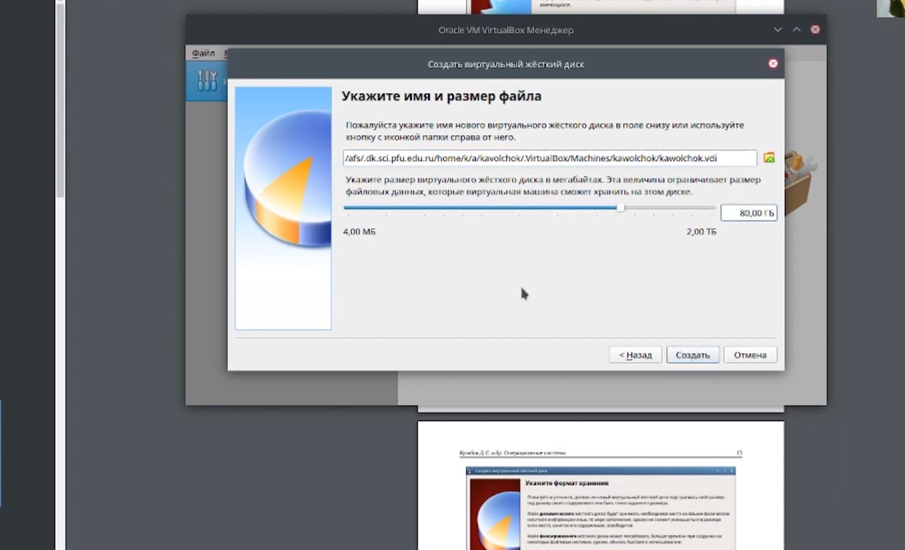

---
## Front matter
title: "Отчёт по лабораторной работе №1"
subtitle: "Информационная безопасность"
author: "Волчок Кристина Александровна"
group: "НПМбд-01-21"
university: "Российский Университет Дружбы Народов"
faculty: "Факультет физико-математических и естественных наук"
department: "Кафедра прикладной математики и теории вероятностей"
date: 2024
city: Москва
## i18n babel
babel-lang: russian
babel-otherlangs: english

## Formatting pdf
toc: false
toc-title: Содержание
slide_level: 2
aspectratio: 169
section-titles: true
theme: metropolis
header-includes:
 - \metroset{progressbar=frametitle,sectionpage=progressbar,numbering=fraction}
---

# Слайд 1: Информация о докладчике

:::::::::::::: {.columns align=center}
::: {.column width="70%"}

  * Волчок Кристина Александровна
  * Российский университет дружбы народов

:::
::: {.column width="30%"}

:::
::::::::::::::

---

# Слайд 2: Цель работы

Цель работы — приобрести практические навыки установки операционной системы на виртуальную машину, настроить минимально необходимые для дальнейшей работы сервисы.

---

# Слайд 3: Установка VirtualBox

Так как в дисплейных классах уже есть VirtualBox, скачивать его не нужно. Но его можно скачать на официальном сайте: [https://www.virtualbox.org](image/image1.png).

---

# Слайд 4: Создание виртуальной машины

Для создания виртуальной машины нажмите «Машина» → «Создать».

---

# Слайд 5: Настройка папки для хранения виртуальной машины

Создайте папку для виртуальной машины на рабочем столе. В данном случае папка называется «kavolchok».

---

# Слайд 6: Установка параметров диска

Задайте имя и размер файла (рекомендуется 80 ГБ).

---

# Слайд 7: Выбор типа машины

Укажите тип операционной системы для виртуальной машины.

---

# Слайд 8: Создание виртуального диска

Создайте виртуальный диск с параметрами по умолчанию, либо настройте дополнительные параметры.

---

# Слайд 9: Первичная настройка завершена

Первичная настройка виртуальной машины завершена. Можно перейти к дополнительным настройкам.

---

# Слайд 10: Настройка процессора

Определите число ядер центрального процессора, которые могут использоваться виртуальной машиной.

---

# Слайд 11: Настройка контроллеров IDE и SATA

Для загрузки системы создайте контроллер IDE и контроллер SATA для жестких дисков.

---

# Слайд 12: Запуск виртуальной машины

Нажмите на кнопку «Запустить» в разделе списка виртуальных машин.

---

# Слайд 13: Установка системы

На экране выбора выберите «Install to Hard Drive».

---

# Слайд 14: Ожидание загрузки

Дождитесь полной загрузки системы перед настройкой.

---

# Слайд 15: Настройка языка и времени

Настройте язык системы и дату/время.

---

# Слайд 16: Настройка разделов диска

Настройте дисковые разделы и выберите диск для установки.

---

# Слайд 17: Создание пользователя

Настройте пользователя и задайте пароль.

---

# Слайд 18: Завершение установки

После завершения установки перезагрузите виртуальную машину.

---

# Слайд 19: Анализ системы

Анализ системы с помощью команды `dmesg` для получения системной информации.

---

# Слайд 20: Вывод

Я приобрела навыки установки операционной системы на виртуальную машину и настройки необходимых сервисов.

