---
## Front matter
title: "Отчёт по лабораторной работе №1"
subtitle: "Информационная безопасность"
author: "Волчок Кристина Александровна"
group: "НПМбд-01-21"
university: "Российский Университет Дружбы Народов"
faculty: "Факультет физико-математических и естественных наук"
department: "Кафедра прикладной математики и теории вероятностей"
date: 2024
city: Москва
## Generic otions
lang: ru-RU
toc-title: "Содержание"

## Bibliography
bibliography: bib/cite.bib
csl: pandoc/csl/gost-r-7-0-5-2008-numeric.csl

## Pdf output format
toc: true # Table of contents
toc-depth: 2
lof: true # List of figures
lot: true # List of tables
fontsize: 12pt
linestretch: 1.5
papersize: a4
documentclass: scrreprt
## I18n polyglossia
polyglossia-lang:
  name: russian
  options:
	- spelling=modern
	- babelshorthands=true
polyglossia-otherlangs:
  name: english
## I18n babel
babel-lang: russian
babel-otherlangs: english
## Fonts
mainfont: IBM Plex Serif
romanfont: IBM Plex Serif
sansfont: IBM Plex Sans
monofont: IBM Plex Mono
mathfont: STIX Two Math
mainfontoptions: Ligatures=Common,Ligatures=TeX,Scale=0.94
romanfontoptions: Ligatures=Common,Ligatures=TeX,Scale=0.94
sansfontoptions: Ligatures=Common,Ligatures=TeX,Scale=MatchLowercase,Scale=0.94
monofontoptions: Scale=MatchLowercase,Scale=0.94,FakeStretch=0.9
mathfontoptions:
## Biblatex
biblatex: true
biblio-style: "gost-numeric"
biblatexoptions:
  - parentracker=true
  - backend=biber
  - hyperref=auto
  - language=auto
  - autolang=other*
  - citestyle=gost-numeric
## Pandoc-crossref LaTeX customization
figureTitle: "Рис."
tableTitle: "Таблица"
listingTitle: "Листинг"
lofTitle: "Список иллюстраций"
lotTitle: "Список таблиц"
lolTitle: "Листинги"
## Misc options
indent: true
header-includes:
  - \usepackage{indentfirst}
  - \usepackage{float} # keep figures where there are in the text
  - \floatplacement{figure}{H} # keep figures where there are in the text
---

# Цель работы

Приобрести практические навыки установки операционной системы на виртуальную машину, настроить минимально необходимые для дальнейшей работы сервисы.

# Ход работы

Так как в дисплейных классах уже есть VirtualBox, скачивать нам его не нужно. Но скачать можно на официальном сайте: [https://www.virtualbox.org](image/image1.png) (Рисунок 1). Необходимо выбрать версию своей операционной системы (Рисунок 2).

Для начала скачаем VirtualBox, необходимую для запуска виртуальных машин.

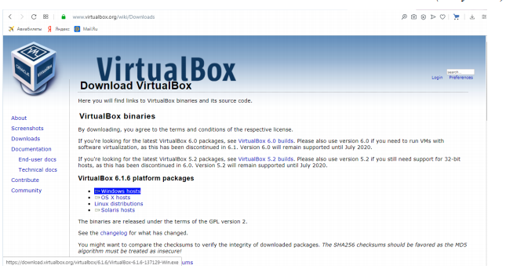

Переходим к созданию виртуальной машины. Для этого нажимаем «Машина» → «Создать».

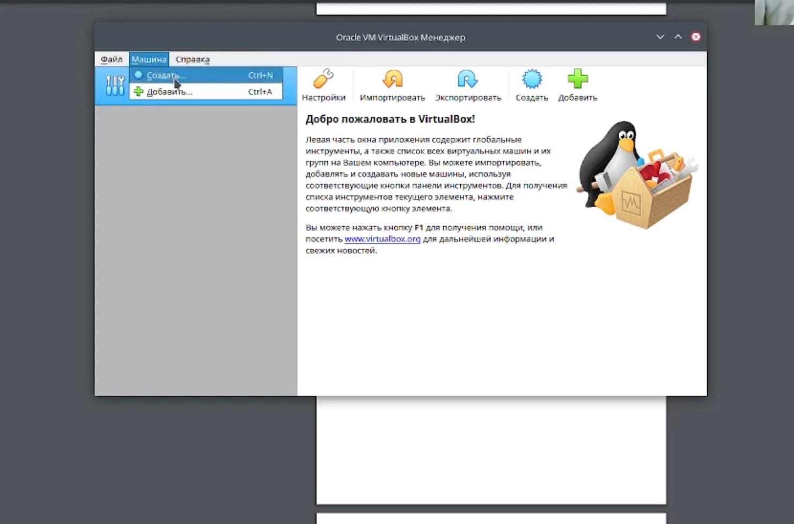

Далее создаём на рабочем столе папку, в которой будет храниться наша виртуальная машина. Имя папки – имя пользователя (логин студента в дисплейном классе). В данном случае «kavolchok». Проверяем в свойствах VirtualBox месторасположение папки для виртуальных машин. Для этого открываем VirtualBox, далее «Файл» → «Свойства» → вкладка «Общие» и в поле «Папка для машин по умолчанию» указываем путь к папке, созданной ранее.

Далее указываем имя и размер файла (нам рекомендуется 80гб).

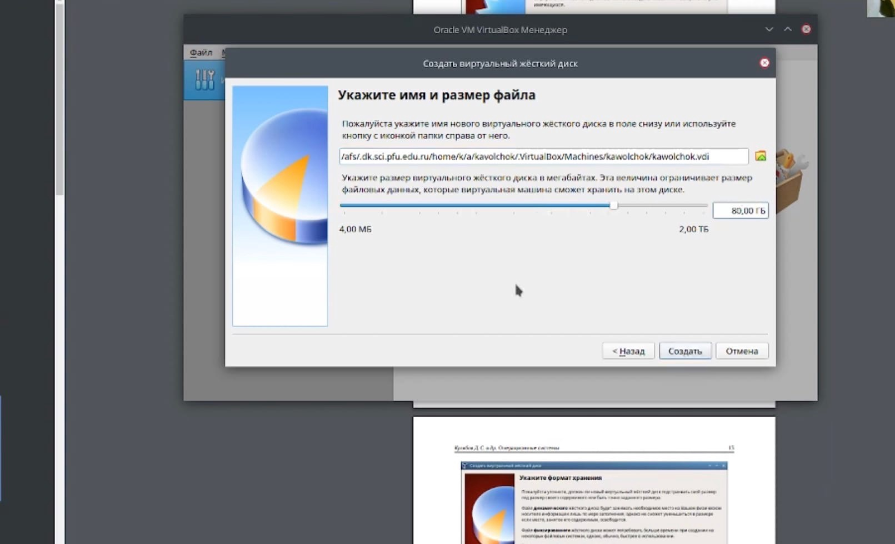

Указываем тип:

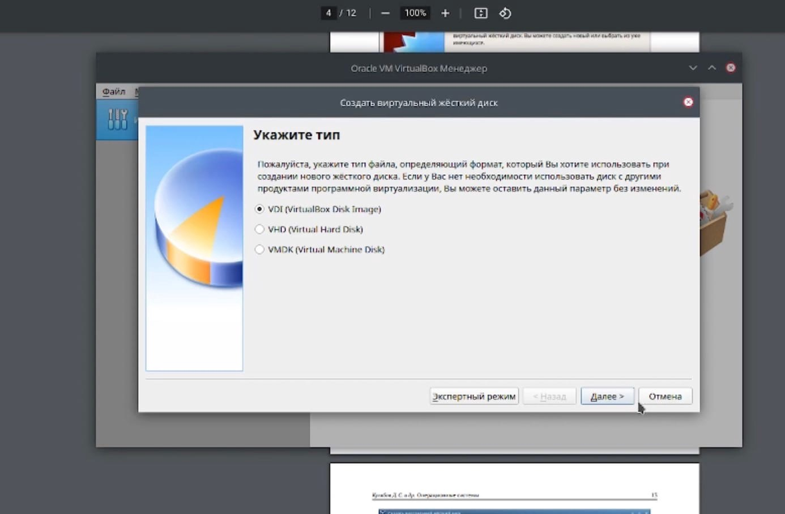

Размер виртуального диска устанавливаем по желанию, но не меньше, чем указано в требованиях операционной системы. Жмем «Создать». Программа VirtualBox сама рекомендует объем жесткого диска для конкретной операционной системы. Однако стоит выбирать больший объем памяти для установки утилит и дополнительных программ, а также для хранения документов и файлов. Для создания нового виртуального диска, нажмите на кнопку «Создать».

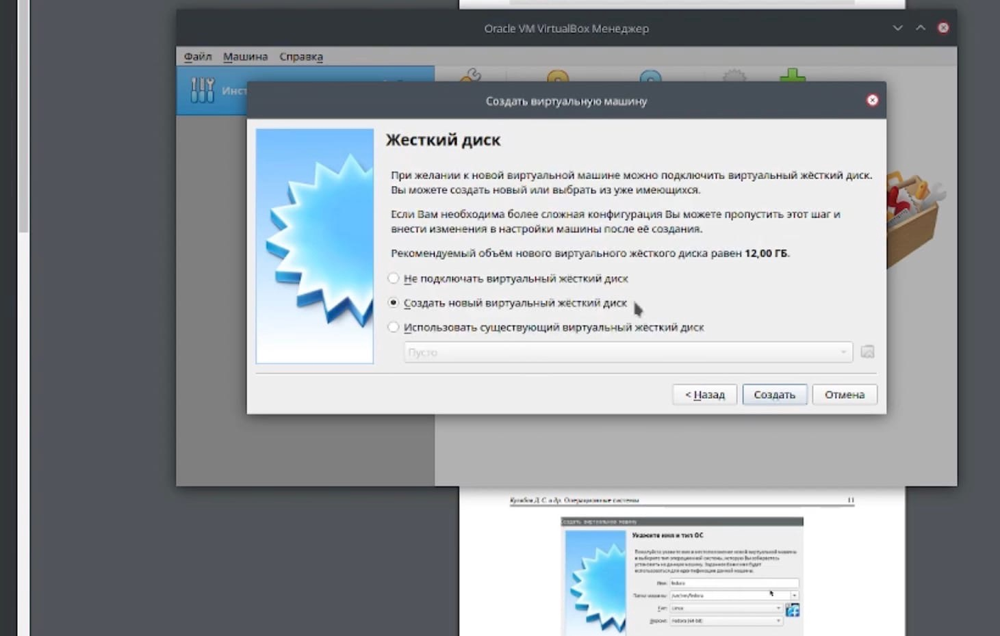

Первичная настройка виртуальной машины окончена.

Теперь можно перейти к дополнительной настройке VM. Для этого перейдем в настройки. В разделе «Система» во вкладке «Процессор» можно определить число ядер центрального процессора компьютера, которые могут использоваться виртуальной машиной, а также предельную допустимую нагрузку на процессор. Рекомендую выделять не менее двух ядер. Решение о том, позволять ли виртуальной машине загружать процессор на 100% принимается исходя из его производительности. На слабых и старых машинах лучше оставить предлагаемую по умолчанию настройку.

В зависимости от типа гостевой операционной системы, который мы выбрали при создании виртуальной машины, типичная компоновка устройств хранения в новой виртуальной машине выглядит следующим образом:
- контроллер IDE, к которому подключен виртуальный CD/DVD привод (к порту «вторичный мастер» контроллера IDE),
- увидим контроллер SATA, который является более современным типом контроллера хранения для увеличения пропускной способности жесткого диска, к которому прикреплены виртуальные жесткие диски. Первоначально у нас обычно будет один такой виртуальный диск, но может быть более одного, каждый из которых представлен файлом образа диска (в этом случае файл VDI).

Я перехожу в контроллер и нажимаю на кнопку «Добавить жесткий диск».

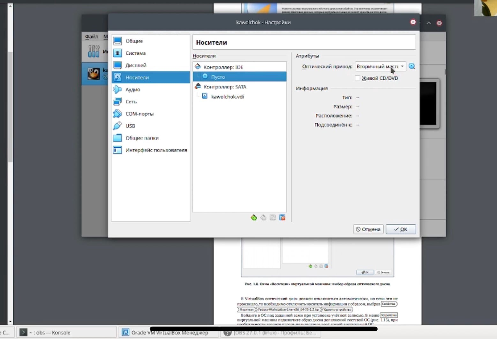

После всех настроек можно перейти к запуску виртуальной машины. Для этого нужно нажать на кнопку «Запустить», находясь в нужном разделе в списке виртуальных машин. У меня она одна.

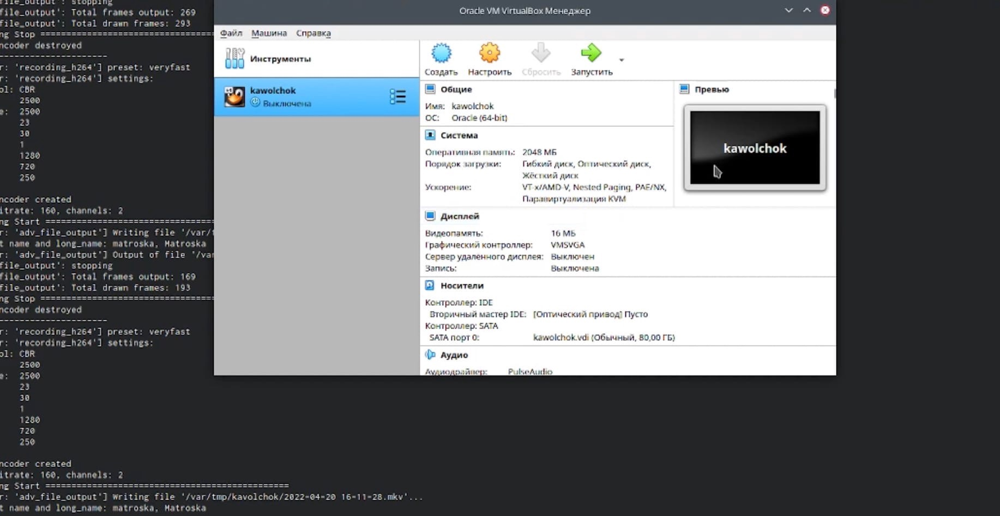

Далее мы выбираем «Install to Hard Drive».

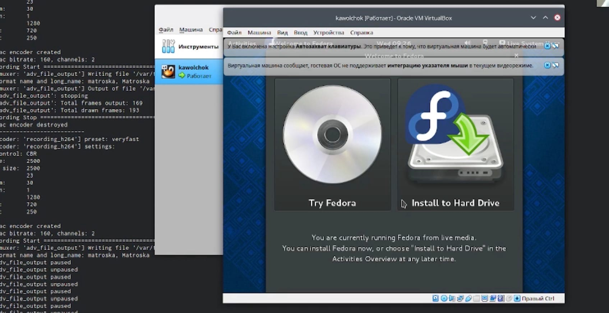

Дожидаемся полной загрузки.

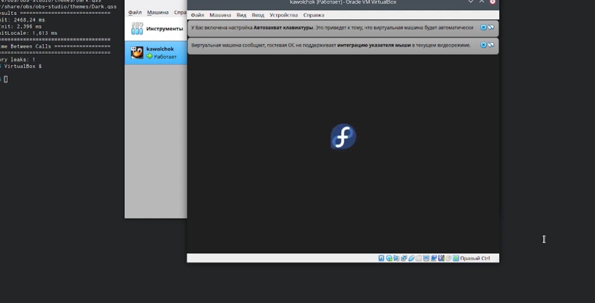

Теперь настраиваем язык.

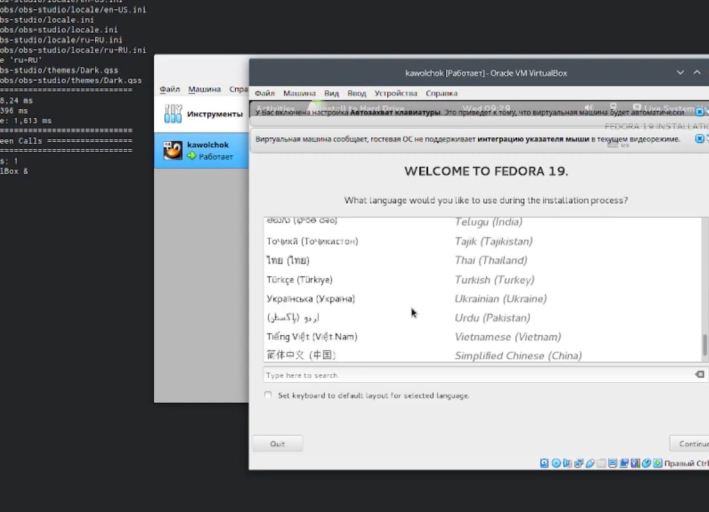

Настраиваем дату и время, а также выбираем место установки.

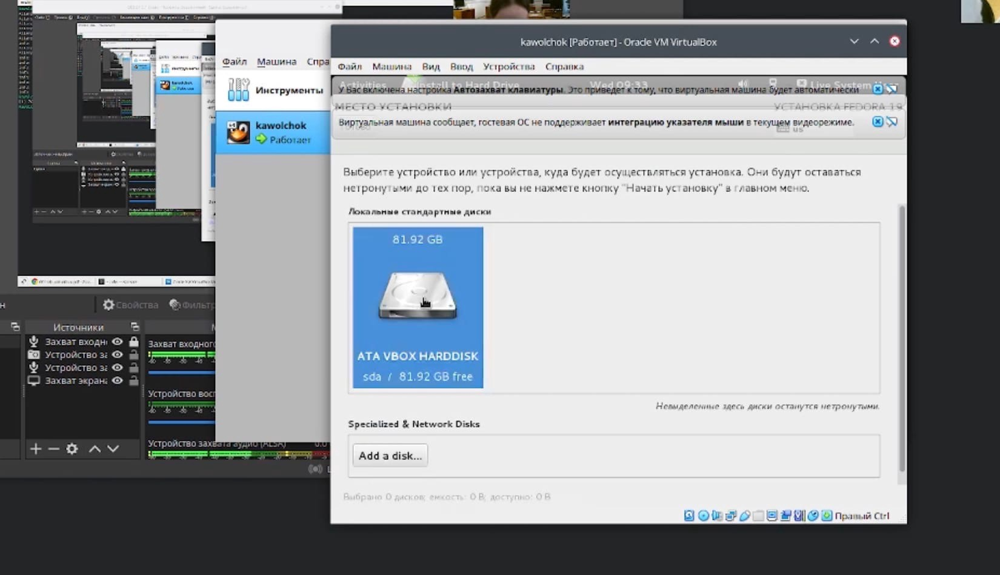

Выбираем диск.

Настраиваем имя пользователя и пароль.

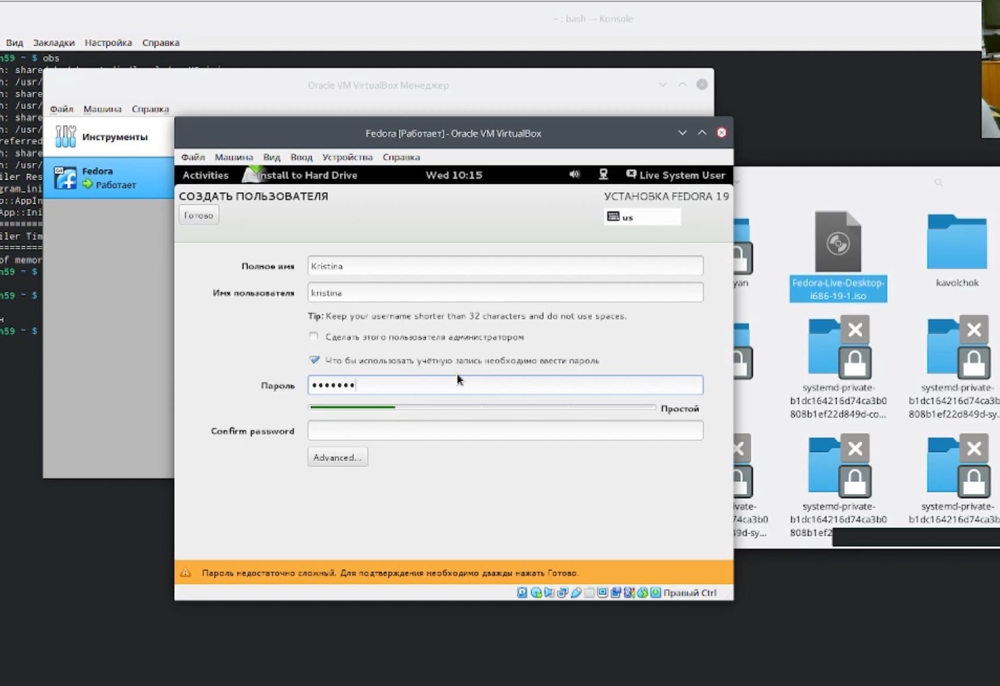

Далее дожидаемся полной загрузки VM.

После корректного перезапускаем.

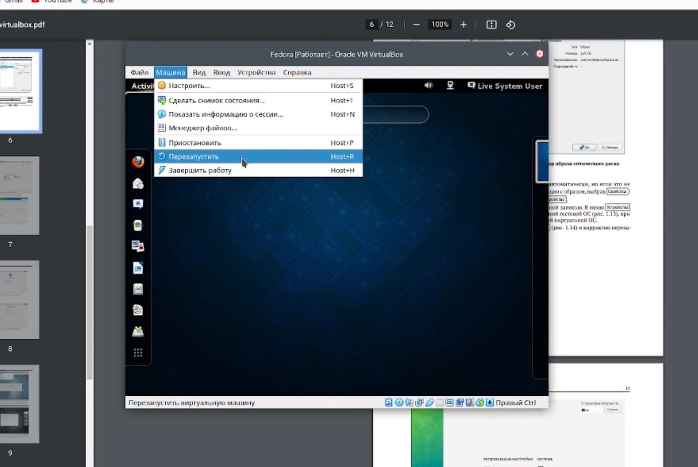

# Вывод

В ходе проделанной лабораторной работы я приобрела практические навыки установки операционной системы на виртуальную машину и настроила минимально необходимые для дальнейшей работы сервисы. А также узнала необходимую мне информацию о моей виртуальной системе через терминал.

# Домашняя работа

После всех проделанных действий я проанализировала последовательность загрузки системы с помощью команды `dmesg`, которая должна выполняться от прав суперпользователя. При использовании этой команды выводится огромный текст с системной информацией.

При последовательном выполнении всех пунктов домашней работы мы можем увидеть информацию о нашем компьютере.

# Контрольные вопросы

1. **Какую информацию содержит учётная запись пользователя?**
   Учётная запись, как правило, содержит сведения, необходимые для опознания пользователя при подключении к системе, сведения для авторизации и учёта. Это идентификатор пользователя (логин) и его пароль. Пароль или его аналог, как правило, хранится в зашифрованном или хэшированном виде для обеспечения его безопасности.

2. **Укажите команды терминала и приведите примеры:**
    - Для получения справки по команде: `help` (пример: `help cd`).
    - Для перемещения по файловой системе: `cd` (пример: `cd /tmp/`).
    - Для просмотра содержимого каталога: `ls` (пример: `ls -a`).
    - Для определения объёма каталога: `du`.
    - Для создания / удаления каталогов / файлов: `mkdir` / `rm` (пример: `rm file`).
    - Для задания определённых прав на файл / каталог: `sudo`.
    - Для просмотра истории команд: `history`.

3. **Что такое файловая система? Приведите примеры с краткой характеристикой.**
   Файловая система определяет формат содержимого и способ физического хранения информации, которую принято группировать в виде файлов. Конкретная файловая система определяет размер имен файлов (и каталогов), максимальный возможный размер файла и раздела, набор атрибутов файла.

4. **Как посмотреть, какие файловые системы подмонтированы в ОС?**
   Используйте команду `mount`.

5. **Как удалить зависший процесс?**
   Используйте команду `kill` с указанием ID процесса: `kill <process_id>`.
