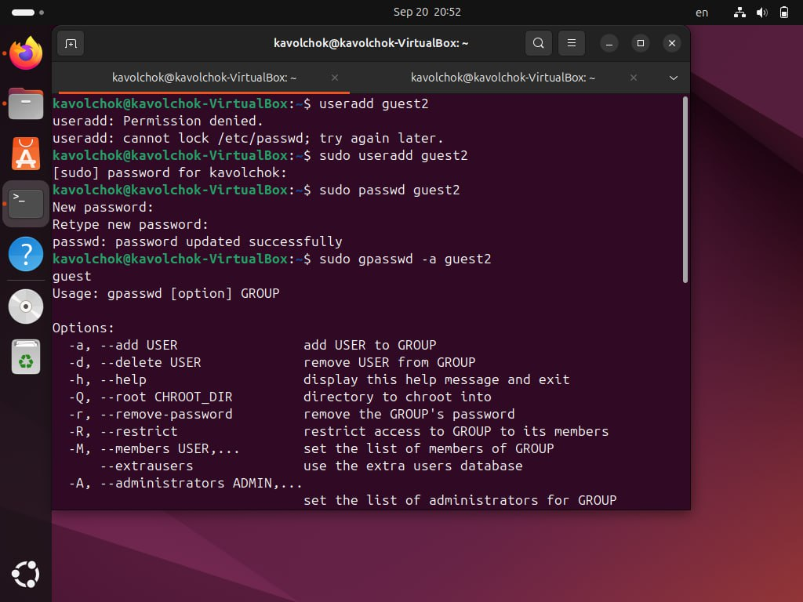
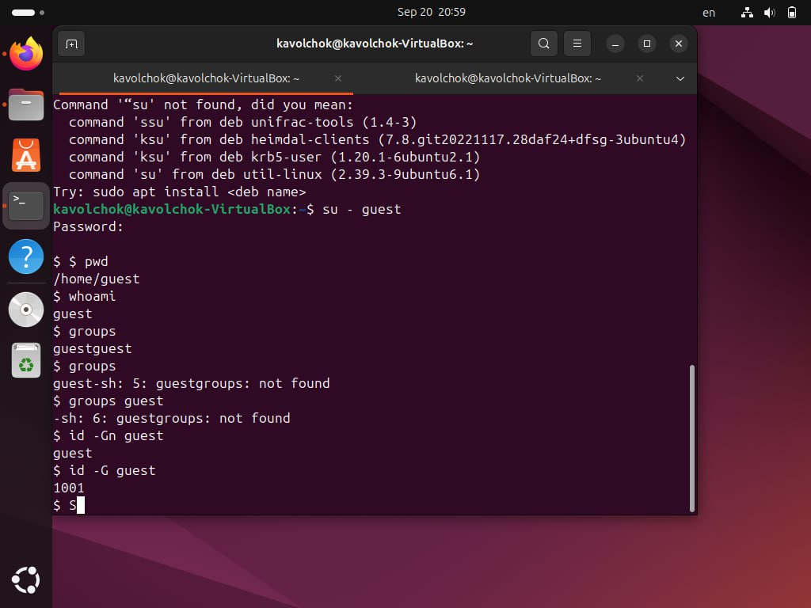
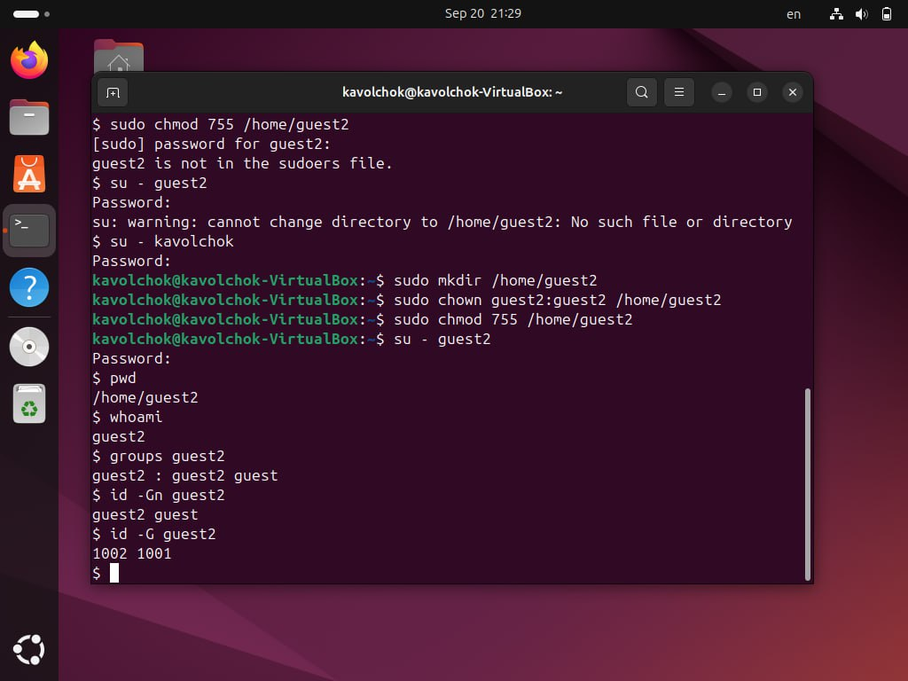
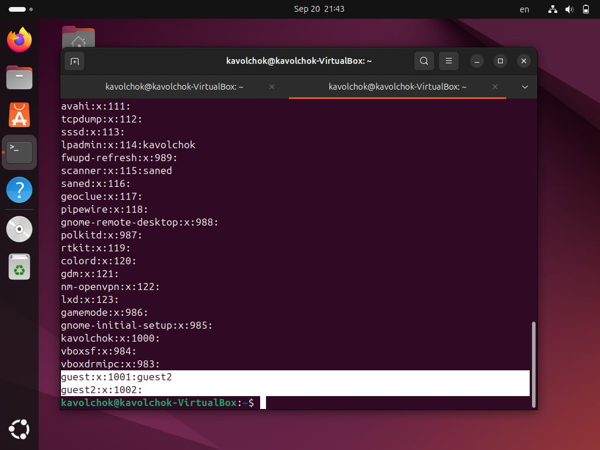
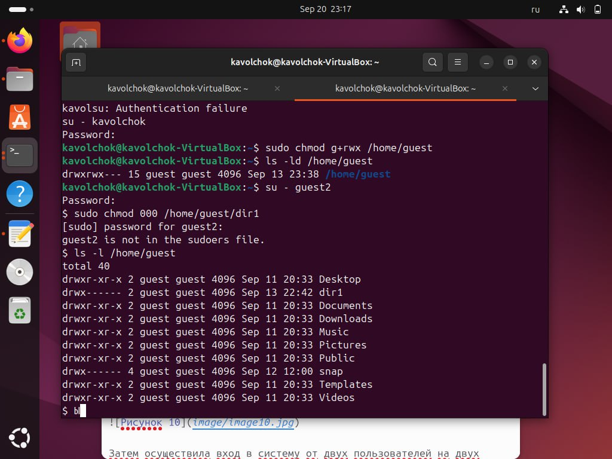

---
## Front matter
title: "Лабораторная работа №3"
subtitle: "Информационная безопасность "
author: "Волчок Кристина Александровна НПМбд-02-21"

## Generic otions
lang: ru-RU

## Bibliography
bibliography: bib/cite.bib
csl: pandoc/csl/gost-r-7-0-5-2008-numeric.csl

## Pdf output format
toc: true # Table of contents
toc-depth: 2
lof: true # List of figures
#lot: true # List of tables
fontsize: 12pt
linestretch: 1.5
papersize: a4
documentclass: scrreprt
## I18n polyglossia
polyglossia-lang:
  name: russian
  options:
	- spelling=modern
	- babelshorthands=true
polyglossia-otherlangs:
  name: english
## I18n babel
babel-lang: russian
babel-otherlangs: english
## Fonts
mainfont: PT Serif
romanfont: PT Serif
sansfont: PT Sans
monofont: PT Mono
mainfontoptions: Ligatures=TeX
romanfontoptions: Ligatures=TeX
sansfontoptions: Ligatures=TeX,Scale=MatchLowercase
monofontoptions: Scale=MatchLowercase,Scale=0.9
## Biblatex
biblatex: true
biblio-style: "gost-numeric"
biblatexoptions:
  - parentracker=true
  - backend=biber
  - hyperref=auto
  - language=auto
  - autolang=other*
  - citestyle=gost-numeric

## Pandoc-crossref LaTeX customization
figureTitle: "Рис."
tableTitle: "Таблица"
listingTitle: "Листинг"
lofTitle: "Список иллюстраций"
lotTitle: "Список таблиц"
lolTitle: "Листинги"

## Misc options
indent: true
header-includes:
  - \usepackage{indentfirst}
  - \usepackage{float} # keep figures where there are in the text
  - \floatplacement{figure}{H} # keep figures where there are in the text
---

# Цель работы

Получение практических навыков работы в консоли с атрибутами файлов для групп пользователей.

# Теоетическое введение 
В операционной системе Linux есть много отличных функций безопасности, но 
одна из самых важных - это система прав доступа к файлам. Изначально каждый
файл имел три параметра доступа. Вот они:

- **Чтение** - разрешает получать содержимое файла, но на запись нет. Для
  каталога позволяет получить список файлов и каталогов, расположенных в
  нём.
- **Запись** - разрешает записывать новые данные в файл или изменять существующие, а также позволяет создавать и изменять файлы и каталоги.
- **Выполнение** - невозможно выполнить программу, если у нее нет флага
  выполнения. Этот атрибут устанавливается для всех программ и скриптов, именно с помощью него система может понять, что этот файл нужно
  запускать как программу.

Каждый файл имеет три категории пользователей, для которых можно устанавливать различные сочетания прав доступа:

- **Владелец** - набор прав для владельца файла, пользователя, который его
  создал или сейчас установлен его владельцем. Обычно владелец имеет все
  права: чтение, запись и выполнение.
- **Группа** - любая группа пользователей, существующая в системе и привязанная к файлу. Но это может быть только одна группа, и обычно это группа
  владельца, хотя для файла можно назначить и другую группу.
- **Остальные** - все пользователи, кроме владельца и пользователей, входящих
  в группу файла.

 Команды, которые могут понадобиться при работе с правами доступа:

- `ls -l` - для просмотра прав доступа к файлам и каталогам.
- `chmod категория действие флаг файл или каталог` - для изменения прав
  доступа к файлам и каталогам (категорию, действие и флаг можно заменить
  на набор из трех цифр от 0 до 7).

 Значения флагов прав:

- `---` - нет никаких прав.
- `-x` - разрешено только выполнение файла, как программы, но не изменение
  и не чтение.
- `-w-` - разрешена только запись и изменение файла.
- `-wx` - разрешено изменение и выполнение, но в случае с каталогом невозможно посмотреть его содержимое.
- `r--` - права только на чтение.
- `r-x` - только чтение и выполнение, без права на запись.
- `rw-` - права на чтение и запись, но без выполнения.
- `rwx` - все права.

Более подробно см. в [1].

# Выполнение лабораторной работы

В установленной при выполнении предыдущей лабораторной работы ОС создала учётную запись пользователя guest2 (т.к. пользователь guest уже был создан в прошлой лабораторной работе) с помощью команды `sudo useradd guest2` и задала пароль для этого пользователя командой `sudo passwd guest2`. Добавила пользователя guest2 в группу guest с помощью команды `sudo gpasswd -a guest2 guest`.

Затем осуществила вход в систему от двух пользователей на двух разных консолях при помощи команд `su - guest` и `su - guest2`. Определила командой `pwd`, что оба пользователя находятся в своих домашних директориях, что совпадает с приглашениями командной строки. Уточнила имена пользователей командой `whoami`, соответственно получила: guest и guest2. С помощью команд `groups guest` и `groups guest2` определила, что пользователь guest входит в группу guest, а пользователь guest2 в группы guest и guest2. Сравнила полученную информацию с выводом команд `id -Gn guest`, `id -Gn guest2`, `id -G guest` и `id -G guest2`: данные совпали, за исключением второй команды `id -G`, которая вывела номера групп 1001 и 1002, что также является верным 

Просмотрела файл /etc/group командой “cat /etc/group”, данные этого файла совпадают с полученными ранее 

От имени пользователя guest2 зарегистрировала этого пользователя в группе guest командой `newgrp guest`. Далее от имени пользователя guest изменила права директории `/home/guest`, разрешив все действия для пользователей группы командой `chmod g+rwx /home/guest`. От имени этого же пользователя сняла с директории `/home/guest/dir1` все атрибуты командой `chmod 000 dir1` и проверила правильность снятия атрибутов командой `ls -l` .

Теперь заполним таблицу «Установленные права и разрешённые действия» 3.1, меняя атрибуты у директории и файла от имени пользователя guest и делая проверку от пользователя guest2.

- Создание файла: `echo "text" > /home/guest/dir1/file2`
- Удаление файла: `rm -r /home/guest/dir1/file1`
- Запись в файл: `echo "textnew" > /home/guest/dir1/file1`
- Чтение файла: `cat /home/guest/dir1/file1`
- Смена директории: `cd /home/guest/dir1`
- Просмотр файлов в директории: `ls /home/guest/dir1`
- Переименование файла: `mv /home/guest/dir1/file1 filenew`
- Смена атрибутов файла: `chattr -a /home/guest/dir1/file1`

| Права директории | Права файла | Создание файла | Удаление файла | Запись в файл | Чтение файла | Смена директории | Просмотр файлов в директории | Переименование файла | Смена атрибутов файла |
|------------------|-------------|----------------|----------------|---------------|---------------|------------------|-----------------------------|----------------------|-----------------------|
| d (000)          | (000)       | -              | -              | -             | -             | -                | -                           | -                    | -                     |
| d -x (010)       | (000)       | -              | -              | -             | -             | +                | -                           | -                    | -                     |
| d -w- (020)      | (000)       | -              | -              | -             | -             | -                | -                           | -                    | -                     |
| d -wx (030)      | (000)       | +              | +              | -             | -             | +                | -                           | +                    | -                     |
| d r-- (040)      | (000)       | -              | -              | -             | -             | -                | +                           | -                    | -                     |
| d r-x (050)      | (000)       | -              | -              | -             | -             | +                | +                           | -                    | -                     |
| d rw- (060)      | (000)       | -              | -              | -             | -             | -                | +                           | -                    | -                     |
| d rwx (070)      | (000)       | +              | +              | -             | -             | +                | +                           | +                    | -                     |
|------------------|-------------|----------------|----------------|---------------|---------------|------------------|-----------------------------|----------------------|-----------------------|
| d (000)          | (010)       | -              | -              | -             | -             | -                | -                           | -                    | -                     |
| d -x (010)       | (010)       | -              | -              | -             | -             | +                | -                           | -                    | -                     |
| d -w- (020)      | (010)       | -              | -              | -             | -             | -                | -                           | -                    | -                     |
| d -wx (030)      | (010)       | +              | +              | -             | -             | +                | -                           | +                    | -                     |
| d r-- (040)      | (010)       | -              | -              | -             | -             | -                | +                           | -                    | -                     |
| d r-x (050)      | (010)       | -              | -              | -             | -             | +                | +                           | -                    | -                     |
| d rw- (060)      | (010)       | -              | -              | -             | -             | -                | +                           | -                    | -                     |
| d rwx (070)      | (010)       | +              | +              | -             | -             | +                | +                           | +                    | -                     |
|------------------|-------------|----------------|----------------|---------------|---------------|------------------|-----------------------------|----------------------|-----------------------|
| d (000)          | (020)       | -              | -              | -             | -             | -                | -                           | -                    | -                     |
| d -x (010)       | (020)       | -              | -              | +             | -             | +                | -                           | -                    | -                     |
| d -w- (020)      | (020)       | -              | -              | -             | -             | -                | -                           | -                    | -                     |
| d -wx (030)      | (020)       | +              | +              | +             | -             | +                | -                           | +                    | -                     |
| d r-- (040)      | (020)       | -              | -              | -             | -             | -                | +                           | -                    | -                     |
| d r-x (050)      | (020)       | -              | -              | +             | -             | +                | +                           | -                    | -                     |
| d rw- (060)      | (020)       | -              | -              | -             | -             | -                | +                           | -                    | -                     |
| d rwx (070)      | (020)       | +              | +              | +             | -             | +                | +                           | +                    | -                     |
|------------------|-------------|----------------|----------------|---------------|---------------|------------------|-----------------------------|----------------------|-----------------------|
| d (000)          | (030)       | -              | -              | -             | -             | -                | -                           | -                    | -                     |
| d -x (010)       | (030)       | -              | -              | +             | -             | +                | -                           | -                    | -                     |
| d -w- (020)      | (030)       | -              | -              | -             | -             | -                | -                           | -                    | -                     |
| d -wx (030)      | (030)       | +              | +              | -             | +             | +                | -                           | +                    | -                     |
| d r-- (040)      | (030)       | -              | -              | -             | -             | -                | +                           | -                    | -                     |
| d r-x (050)      | (030)       | -              | -              | +             | -             | +                | +                           | -                    | -                     |
| d rw- (060)      | (030)       | -              | -              | -             | -             | -                | +                           | -                    | -                     |
| d rwx (070)      | (030)       | +              | +              | +             | -             | +                | +                           | +                    | -                     |
|------------------|-------------|----------------|----------------|---------------|---------------|------------------|-----------------------------|----------------------|-----------------------|
| d (000)          | (040)       | -              | -              | -             | -             | -                | -                           | -                    | -                     |
| d -x (010)       | (040)       | -              | -              | -             | +             | +                | -                           | -                    | -                     |
| d -w- (020)      | (040)       | -              | -              | -             | -             | -                | -                           | -                    | -                     |
| d -wx (030)      | (040)       | +              | +              | -             | +             | +                | -                           | +                    | -                     |
| d r-- (040)      | (040)       | -              | -              | -             | -             | -                | +                           | -                    | -                     |
| d r-x (050)      | (040)       | -              | -              | -             | +             | +                | +                           | -                    | -                     |
| d rw- (060)      | (040)       | -              | -              | -             | -             | -                | +                           | -                    | -                     |
| d rwx (070)      | (040)       | +              | +              | -             | +             | +                | +                           | +                    | -                     |

Сравнивая полученную таблицу с таблицей из прошлой лабораторной работы, приходим к выводу, что изменился только последний столбец, позволяющий изменять атрибуты у файла: теперь это сделать невозможно, т.к. у владельца файла и директории нет на это прав (во всех случаях в первой позиции стоят 0). При определённом наборе прав остальные действия выполняются или не выполняются аналогично предыдущей таблице, но теперь как для владельца, так и для группы.

Заполним таблицу «Минимально необходимые права для выполнения операций внутри директории» 3.2.

Таблица 3.2: Минимально необходимые права для выполнения операций внутри директории

| Операция             | Минимальные права на директорию | Минимальные права на файл |
|----------------------|---------------------------------|---------------------------|
| Создание файла        | d -wx (030)                     | (000)                     |
| Удаление файла        | d -wx (030)                     | (000)                     |
| Чтение файла          | d -x (010)                      | (040)                     |
| Запись в файл         | d -x (010)                      | (020)                     |
| Переименование файла  | d -wx (030)                     | (000)                     |

---

| Операция                   | Минимальные права на директорию | Минимальные права на файл |
|----------------------------|---------------------------------|---------------------------|
| Создание поддиректории      | d -wx (030)                     | (000)                     |
| Удаление поддиректории      | d -wx (030)                     | (000)                     |

# Вывод
В ходе выполнения данной лабораторной работы я получила практические навыки работы в консоли с атрибутами файлов для групп пользователей.

