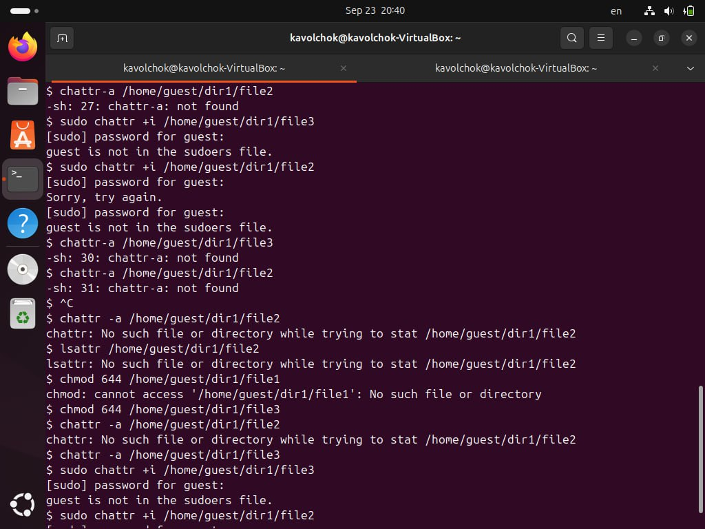

---
## Front matter
title: "Лабораторная работа №4"
subtitle: "Информационная безопасность "
author: "Волчок Кристина Александровна НПМбд-02-21"

## Generic otions
lang: ru-RU
toc-title: "Содержание"

## Bibliography
bibliography: bib/cite.bib
csl: pandoc/csl/gost-r-7-0-5-2008-numeric.csl

## Pdf output format
toc: true # Table of contents
toc-depth: 2
lof: true # List of figures
fontsize: 12pt
linestretch: 1.5
papersize: a4
documentclass: scrreprt
## I18n polyglossia
polyglossia-lang:
  name: russian
  options:
	- spelling=modern
	- babelshorthands=true
polyglossia-otherlangs:
  name: english
## I18n babel
babel-lang: russian
babel-otherlangs: english
## Fonts
mainfont: IBM Plex Serif
romanfont: IBM Plex Serif
sansfont: IBM Plex Sans
monofont: IBM Plex Mono
mathfont: STIX Two Math
mainfontoptions: Ligatures=Common,Ligatures=TeX,Scale=0.94
romanfontoptions: Ligatures=Common,Ligatures=TeX,Scale=0.94
sansfontoptions: Ligatures=Common,Ligatures=TeX,Scale=MatchLowercase,Scale=0.94
monofontoptions: Scale=MatchLowercase,Scale=0.94,FakeStretch=0.9
mathfontoptions:
## Biblatex
biblatex: true
biblio-style: "gost-numeric"
biblatexoptions:
  - parentracker=true
  - backend=biber
  - hyperref=auto
  - language=auto
  - autolang=other*
  - citestyle=gost-numeric
## Pandoc-crossref LaTeX customization
figureTitle: "Рис."
tableTitle: "Таблица"
listingTitle: "Листинг"
lofTitle: "Список иллюстраций"
lolTitle: "Листинги"
## Misc options
indent: true
header-includes:
  - \usepackage{indentfirst}
  - \usepackage{float} # keep figures where there are in the text
  - \floatplacement{figure}{H} # keep figures where there are in the text
---

# Цель работы

Получение практических навыков работы в консоли с расширенными атрибутами файлов.

# Задание

Здесь приводится описание задания в соответствии с рекомендациями
методического пособия и выданным вариантом.

# Теоретическое введение

В UNIX-системах, кроме стандартных прав доступа, существуют также дополнительные или специальные атрибуты файлов, которые поддерживает файловая система. Управлять атрибутами можно с помощью команды “chattr”.

Виды расширенных атрибутов:

- **a** — файл можно открыть только в режиме добавления для записи
- **A** — при доступе к файлу его запись atime не изменяется
- **c** — файл автоматически сжимается на диске ядром
- **C** — файл не подлежит обновлению «копирование при записи»
- **d** — файл не является кандидатом для резервного копирования при запуске программы dump
- **D** — при изменении каталога изменения синхронно записываются на диск
- **e** — файл использует экстенты для отображения блоков на диске. Его нельзя удалить с помощью chattr
- **E** — файл, каталог или символическая ссылка зашифрованы файловой системой. Этот атрибут нельзя установить или сбросить с помощью chattr, хотя он может быть отображён с помощью lsattr
- **F** — директория указывает, что все поиски путей внутри этого каталога выполняются без учёта регистра. Этот атрибут можно изменить только в пустых каталогах в файловых системах с включённой функцией casefold
- **i** — файл не может быть изменён: его нельзя удалить или переименовать, нельзя создать ссылку на этот файл, большую часть метаданных файла нельзя изменить, и файл нельзя открыть в режиме записи и другие. 

# Выполнение лабораторной работы

От имени пользователя `guest` определила расширенные атрибуты файла `/home/guest/dir1/file1` командой `lsattr /home/guest/dir1/file1`. Командой `chmod 600 /home/guest/dir1/file1` установила права, разрешающие чтение и запись для владельца файла. При попытке использовать команду `chattr +a /home/guest/dir1/file1` для установления расширенного атрибута “a” получила отказ в выполнении операции.

 

От имени суперпользователя установила расширенный атрибут “a” на файл командой `sudo chattr +a /home/guest/dir1/file1` и от имени пользователя guest проверила правильность установления атрибута командой `lsattr /home/guest/dir1/file1`.

 

Дозаписала в файл file1 слово “test” командой `echo "test" >> /home/guest/dir1/file1`, и, используя команду `cat /home/guest/dir1/file1`, убедилась, что указанное ранее слово было успешно записано в файл. Аналогично записала в файл слово “abcd”. Далее попробовала стереть имеющуюся в файле информацию командой `echo "abcd" > /home/guest/dir1/file1`, но получила отказ. Попробовала переименовать файл командой `rename file1 file2 /home/guest/dir1/file1` и изменить права доступа командой `chmod 000 /home/guest/dir1/file1` — и также получила отказ.

 {#fig:003 width=70%}

Сняла расширенный атрибут “a” с файла от имени суперпользователя командой `sudo chattr -a /home/guest/dir1/file1` и повторила операции, которые ранее не получилось выполнить — теперь ошибок не было, и операции были выполнены.

 

От имени суперпользователя командой `sudo chattr +i /home/guest/dir1/file1` установила расширенный атрибут “i” и повторила действия, которые выполняла ранее. В данном случае файл можно было только прочитать, а изменить или записать в него что-то, переименовать и изменить его атрибуты было невозможно.

 

# Выводы

В ходе выполнения данной лабораторной работы я получила практические навыки работы в консоли с расширенными атрибутами файлов, на практике опробовала действие расширенных атрибутов “a” и “i”.

# Список литературы

1. Атрибуты файлов в Linux [Электронный ресурс]. URL: https://zalinux.ru/?p=6440

