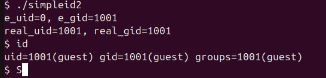
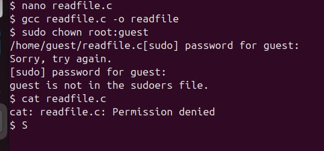
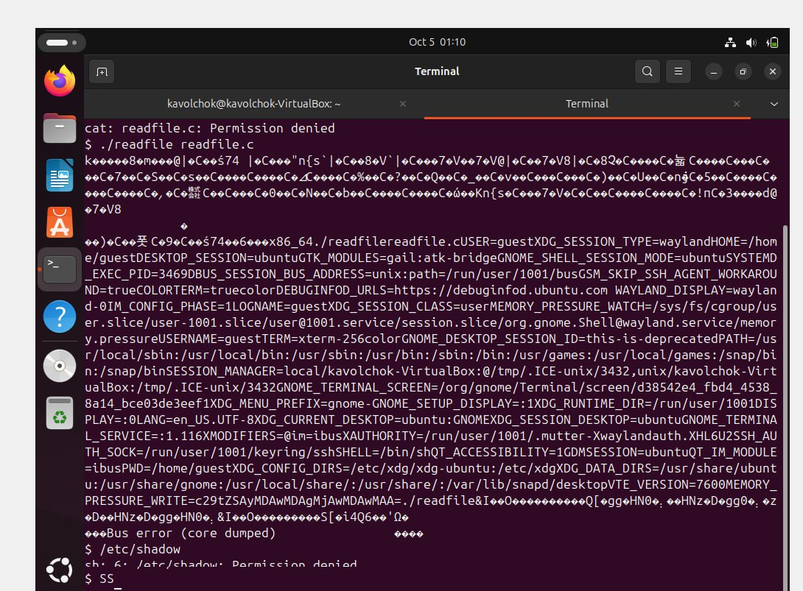

---
## Front matter
title: "Лабораторная работа №5"
subtitle: "Информационная безопасность "
author: "Волчок Кристина Александровна НПМбд-02-21"
## Generic otions
lang: ru-RU
toc-title: "Содержание"

## Bibliography
bibliography: bib/cite.bib
csl: pandoc/csl/gost-r-7-0-5-2008-numeric.csl

## Pdf output format
toc: true # Table of contents
toc-depth: 2
lof: true # List of figures
fontsize: 12pt
linestretch: 1.5
papersize: a4
documentclass: scrreprt
## I18n polyglossia
polyglossia-lang:
  name: russian
  options:
	- spelling=modern
	- babelshorthands=true
polyglossia-otherlangs:
  name: english
## I18n babel
babel-lang: russian
babel-otherlangs: english
## Fonts
mainfont: IBM Plex Serif
romanfont: IBM Plex Serif
sansfont: IBM Plex Sans
monofont: IBM Plex Mono
mathfont: STIX Two Math
mainfontoptions: Ligatures=Common,Ligatures=TeX,Scale=0.94
romanfontoptions: Ligatures=Common,Ligatures=TeX,Scale=0.94
sansfontoptions: Ligatures=Common,Ligatures=TeX,Scale=MatchLowercase,Scale=0.94
monofontoptions: Scale=MatchLowercase,Scale=0.94,FakeStretch=0.9
mathfontoptions:
## Biblatex
biblatex: true
biblio-style: "gost-numeric"
biblatexoptions:
  - parentracker=true
  - backend=biber
  - hyperref=auto
  - language=auto
  - autolang=other*
  - citestyle=gost-numeric
## Pandoc-crossref LaTeX customization
figureTitle: "Рис."
tableTitle: "Таблица"
listingTitle: "Листинг"
lofTitle: "Список иллюстраций"
lolTitle: "Листинги"
## Misc options
indent: true
header-includes:
  - \usepackage{indentfirst}
  - \usepackage{float} # keep figures where there are in the text
  - \floatplacement{figure}{H} # keep figures where there are in the text
---

# Цель работы

Изучение механизмов изменения идентификаторов, применения SetUID- и Sticky-битов. Получение практических навыков работы в консоли с дополнительными атрибутами. Рассмотрение работы механизма смены идентификатора процессов пользователей, а также влияние бита Sticky на запись и удаление файлов.

# Теоретическое введение

SetUID, SetGID и Sticky - это специальные типы разрешений, которые позволяют задавать расширенные права доступа на файлы или каталоги. 
• **SetUID** (set user ID upon execution — «установка ID пользователя во время выполнения») являются флагами прав доступа в Unix, которые разрешают пользователям запускать исполняемые файлы с правами владельца исполняемого файла. 
• **SetGID** (set group ID upon execution — «установка ID группы во время выполнения») являются флагами прав доступа в Unix, которые разрешают пользователям запускать исполняемые файлы с правами группы исполняемого файла. 
• **Sticky bit** в основном используется в общих каталогах, таких как /var или /tmp, поскольку пользователи могут создавать файлы, читать и выполнять их, принадлежащие другим пользователям, но не могут удалять файлы, принадлежащие другим пользователям. 

# Выполнение лабораторной работы

**Создание программы**:

Для начала я убедилась, что компилятор gcc установлен, используя команду `gcc -v`. Затем отключила систему запретов до очередной перезагрузки системы командой `sudo setenforce 0`, после чего команда `getenforce` вывела "Permissive".

 

Проверила успешное выполнение команд “whereis gcc” и “whereis g++” (их расположение). Вошла в систему от имени пользователя guest командой “su - guest”. Создала программу simpleid.c командой “touch simpleid.c” и открыла её в редакторе
командой “gedit /home/guest/simpleid.c”.

 

Код программы выглядит следующим образом.

 

Скомпилировала программу и убедилась, что файл программы был создан
командой “gcc simpleid.c -o simpleid”. Выполнила программу simpleid командой“./simpleid”, а затем выполнила системную программу id командой “id”. Результаты, полученные в результате выполнения обеих команд, совпадают (uid=1001 иgid=1001) .

 

Усложнила программу, добавив вывод действительных идентификаторов .

 

Получившуюся программу назвала simpleid2.c.

 

Скомпилировала и запустила simpleid2.c командами “gcc simpleid2.c -o sipleid2” и “./simpleid2”.

 

От имени суперпользователя выполнила команды “sudo chown root:guest
/home/guest/simpleid2” и “sudo chmod u+s /home/guest/simpleid2”, затем выполнила проверку правильности установки новых атрибутов и смены владельца файла simpleid2 командой “sudo ls -l /home/guest/simpleid2”. Этими командами была произведена смена пользователя файла на root и установлен SetUID-бит.

 

Запустила программы simpleid2 и id. Теперь появились различия в uid.

 

Проделала тоже самое относительно SetGID-бита. Также можем заметить различия с предыдущим пунктом. Далее создаем программу readfile.c.

Скомпилировала созданную программу командой “gcc readfile.c -o readfile”.Сменила владельца у файла readfile.c командой “sudo chown root:guest/home/guest/readfile.c” и поменяла права так, чтобы только суперпользовательмог прочитать его, а guest не мог, спомощью команды “sudo chmod 700 home/guest/readfile.c”. Теперь убедилась, что пользователь guest не может прочитать файл readfile.c командой “cat readfile.c”, получив отказ в доступе 

 

Поменяла владельца у программы readfile и устанавила SetUID. Проверила, может ли программа readfile прочитать файл readfile.c командой “./readfile readfile.c”. Прочитать удалось.Аналогично проверила, можно ли прочитать файл /etc/shadow. Прочитать удалось.

 

**Исследование Sticky-бита**:

Командой “ls -l / | grep tmp” убеждилась, что атрибут Sticky на директории /tmp установлен. От имени пользователя guest создала файл file01.txt в директории /tmp со словом test командой “echo”test” > /tmp/file01.txt”. Просматрела атрибуты у только что созданного файла и разрешаем чтение и запись для категории пользователей “все остальные” командами “ls -l /tmp/file01.txt” и “chmod o+rw /tmp/file01.txt”.

 

От имени пользователя guest2 попробовала прочитать файл командой “cat/tmp/file01.txt” - это удалось. Далее попыталась дозаписать в файл слово test2,проверить содержимое файла и записать в файл слово test3, стерев при этом всю имеющуюся в файле информацию - эти операции удалось выполнить только в случае, если еще дополнительно разрешить чтение и запись для группы пользователей командой “chmod g+rw /tmp/file01.txt”. От имени пользователя guest2 попробовала удалить файл - это не удается ни в каком из случаев, возникает ошибка. 

 

Повысила права до суперпользователя командой “su -” и выполнила команду, снимающую атрибут t с директории /tmp “chmod -t /tmp”. После чего покинула режим суперпользователя командой “exit”. Повторила предыдущие шаги. Теперь мне удалось удалить файл file01.txt от имени пользователя, не являющегося его владельцем.

 

И далее овысила свои права до суперпользователя и вернула атрибут t на директорию /tmp

# Выводы

В ходе выполнения данной лабораторной работы я изучила механизмы изменения идентификаторов, применение SetUID- и Sticky-битов. Получила практические навыки работы в консоли с дополнительными атрибутами. Рассмотрела
работу механизма смены идентификатора процессов пользователей, а также
влияние бита Sticky на запись и удаление файлов.

# Список литературы

Стандартные права SetUID, SetGID, Sticky в Linux [Электронный ресурс].
URL: https://linux-notes.org/standartny-e-prava-unix-suid-sgid-sticky-bity/.

