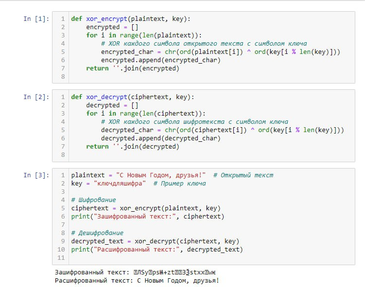
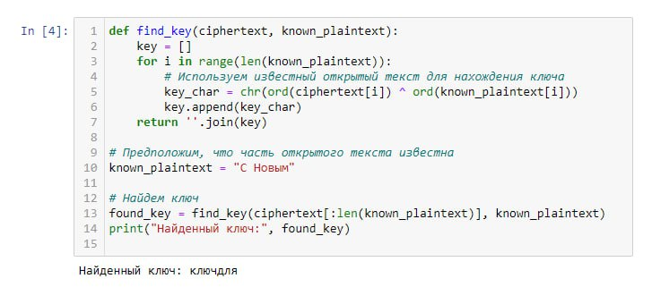

---
## Front matter
title: "Лабораторная работа №7"
subtitle: "Информационная безопасность "
author: "Волчок Кристина Александровна НПМбд-02-21"

## Generic otions
lang: ru-RU
toc-title: "Содержание"

## Bibliography
bibliography: bib/cite.bib
csl: pandoc/csl/gost-r-7-0-5-2008-numeric.csl

## Pdf output format
toc: true # Table of contents
toc-depth: 2
lof: true # List of figures
fontsize: 12pt
linestretch: 1.5
papersize: a4
documentclass: scrreprt
## I18n polyglossia
polyglossia-lang:
  name: russian
  options:
	- spelling=modern
	- babelshorthands=true
polyglossia-otherlangs:
  name: english
## I18n babel
babel-lang: russian
babel-otherlangs: english
## Fonts
mainfont: IBM Plex Serif
romanfont: IBM Plex Serif
sansfont: IBM Plex Sans
monofont: IBM Plex Mono
mathfont: STIX Two Math
mainfontoptions: Ligatures=Common,Ligatures=TeX,Scale=0.94
romanfontoptions: Ligatures=Common,Ligatures=TeX,Scale=0.94
sansfontoptions: Ligatures=Common,Ligatures=TeX,Scale=MatchLowercase,Scale=0.94
monofontoptions: Scale=MatchLowercase,Scale=0.94,FakeStretch=0.9
mathfontoptions:
## Biblatex
biblatex: true
biblio-style: "gost-numeric"
biblatexoptions:
  - parentracker=true
  - backend=biber
  - hyperref=auto
  - language=auto
  - autolang=other*
  - citestyle=gost-numeric
## Pandoc-crossref LaTeX customization
figureTitle: "Рис."
tableTitle: "Таблица"
listingTitle: "Листинг"
lofTitle: "Список иллюстраций"
lolTitle: "Листинги"
## Misc options
indent: true
header-includes:
  - \usepackage{indentfirst}
  - \usepackage{float} # keep figures where there are in the text
  - \floatplacement{figure}{H} # keep figures where there are in the text
---

# Цель работы

Освоить практические навыки применения криптографического метода однократного гаммирования для шифрования и дешифрования данных. Разработать программу, которая выполняет шифрование и дешифрование на основе данного метода, а также провести подбор ключа для расшифровки сообщения.

# Теоретическое введение

**Однократное гаммирование (шифр Вернама)** — это метод симметричного шифрования, предложенный Гилбертом Вернамом. Этот метод основан на использовании случайной гаммы, представляющей собой последовательность символов, которая используется для наложения на открытый текст. Гаммирование предполагает выполнение побитовой операции XOR (побитовое сложение по модулю 2) между элементами ключа и элементами открытого текста.

Такой метод обеспечивает абсолютную стойкость шифра при выполнении нескольких условий:
1. Ключ является полностью случайным.
2. Длина ключа равна длине шифруемого текста.
3. Ключ используется только один раз.

 Преимущества однократного гаммирования:
1. **Абсолютная криптографическая стойкость** — при условии соблюдения всех правил, шифр Вернама невозможно взломать.
2. **Простота реализации** — алгоритм легко реализовать программно, используя операцию XOR.
3. **Симметричность** — операция XOR является обратимой, поэтому для шифрования и дешифрования используется одна и та же операция.

Недостатки однократного гаммирования:
1. **Необходимость использования одноразового ключа** — ключ не может быть повторно использован для шифрования других сообщений.
2. **Требование к длине ключа** — длина ключа должна быть такой же, как длина шифруемого сообщения.
3. **Трудность в управлении ключами** — генерация и передача длинных ключей вызывает сложности, особенно для больших объёмов данных.

 Операция XOR
XOR (исключающее "ИЛИ") — это логическая операция, которая сравнивает два бита и возвращает результат, равный 1, если биты различны, и 0, если биты одинаковы. Это ключевая операция в шифре Вернама, так как она позволяет как зашифровать текст, так и расшифровать его, если ключ известен.

Примеры работы XOR над битами:
- `0 ⊕ 0 = 0`
- `0 ⊕ 1 = 1`
- `1 ⊕ 0 = 1`
- `1 ⊕ 1 = 0`

Условия абсолютной стойкости шифра:
1. **Полная случайность ключа** — ключ должен быть абсолютно случайным и не зависеть от открытого текста.
2. **Равенство длины ключа и текста** — длина ключа должна быть равна длине шифруемого сообщения.
3. **Однократное использование ключа** — ключ может быть использован только один раз для одного сообщения.

К. Шеннон доказал, что при соблюдении этих условий шифр Вернама обладает абсолютной стойкостью, то есть даже при наличии зашифрованного текста невозможно извлечь исходное сообщение без знания ключа. Более того, все возможные сообщения, равные по длине исходному, могут быть результатом шифрования, что делает текст неразличимым для криптоаналитика.

Таким образом, шифр Вернама считается одним из самых безопасных методов шифрования при условии, что ключ используется только один раз и его длина совпадает с длиной шифруемого сообщения. Этот метод находит применение в системах, где требуется высокая степень безопасности и невозможность раскрытия данных.

# Выполнение лабораторной работы

В первом шаге я создаю функцию шифрования, которая использует операцию XOR. Для каждого символа открытого текста я выполняю побитовое сложение с символом ключа, чтобы получить зашифрованное сообщение. Если длина ключа меньше длины текста, ключ повторяется по циклу, чтобы соответствовать каждому символу текста.

На втором шаге я разрабатываю функцию для дешифрования. Здесь используется тот же принцип, что и в шифровании, поскольку операция XOR обратима. Функция восстанавливает исходный текст, выполняя XOR между шифротекстом и ключом, что позволяет получить исходное сообщение.

Третий шаг заключается в тестировании обеих функций. Я беру текст «С Новым Годом, друзья!» и ключ «ключдляшифра», после чего шифрую текст, получая строку специальных символов. Далее я применяю функцию дешифрования и проверяю, что исходный текст успешно восстанавливается, что подтверждает корректность работы программы.

На следующем этапе я создаю функцию для подбора ключа. Эта функция позволяет вычислить ключ на основе известного фрагмента открытого текста. Я беру фрагмент «С Новым» и использую его вместе с шифротекстом для нахождения ключа. В результате программа успешно находит ключ «ключдля».

Таким образом, в процессе работы я последовательно реализую функции для шифрования, дешифрования и подбора ключа. Все функции протестированы и работают корректно, что подтверждает успешное выполнение задания.

# Выводы

В ходе выполнения лабораторной работы был реализован метод однократного гаммирования (шифр Вернама) для шифрования и дешифрования данных. Были разработаны функции для выполнения операции XOR над открытым текстом и ключом, а также для восстановления текста по известному шифротексту и ключу.

В результате работы были достигнуты следующие результаты:
- Успешно выполнено шифрование и дешифрование сообщения с использованием заданного ключа.
- Подобран ключ для получения заданного фрагмента открытого текста на основе шифротекста.
- Продемонстрирована абсолютная стойкость шифра Вернама при соблюдении условия однократного использования ключа.

Метод однократного гаммирования обеспечивает высокий уровень безопасности, однако требует генерации и хранения ключей, длина которых соответствует длине шифруемого сообщения. Это делает его сложным для практического использования в условиях передачи большого объема данных, но он остаётся эффективным для специальных задач, где требуется максимальная защита информации.

Задачи, поставленные в начале работы, были успешно решены, что подтвердило практическую применимость шифра Вернама.

# Список литературы

Однократное гаммирование URL: https://esystem.
rudn.ru/pluginfile.php/1651639/mod_resource/content/2/007-lab_cryptogamma.pdf.

