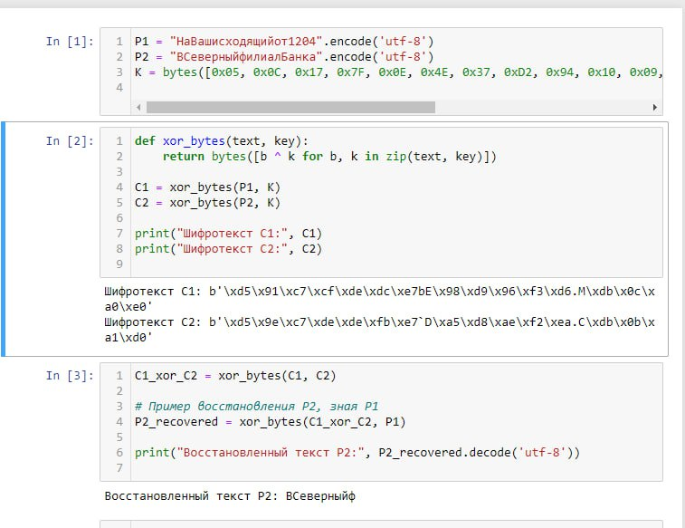

---
## Front matter
title: "Лабораторная работа №8"
subtitle: "Информационная безопасность "
author: "Волчок Кристина Александровна НПМбд-02-21"

## Generic otions
lang: ru-RU
toc-title: "Содержание"

## Bibliography
bibliography: bib/cite.bib
csl: pandoc/csl/gost-r-7-0-5-2008-numeric.csl

## Pdf output format
toc: true # Table of contents
toc-depth: 2
lof: true # List of figures
fontsize: 12pt
linestretch: 1.5
papersize: a4
documentclass: scrreprt
## I18n polyglossia
polyglossia-lang:
  name: russian
  options:
	- spelling=modern
	- babelshorthands=true
polyglossia-otherlangs:
  name: english
## I18n babel
babel-lang: russian
babel-otherlangs: english
## Fonts
mainfont: IBM Plex Serif
romanfont: IBM Plex Serif
sansfont: IBM Plex Sans
monofont: IBM Plex Mono
mathfont: STIX Two Math
mainfontoptions: Ligatures=Common,Ligatures=TeX,Scale=0.94
romanfontoptions: Ligatures=Common,Ligatures=TeX,Scale=0.94
sansfontoptions: Ligatures=Common,Ligatures=TeX,Scale=MatchLowercase,Scale=0.94
monofontoptions: Scale=MatchLowercase,Scale=0.94,FakeStretch=0.9
mathfontoptions:
## Biblatex
biblatex: true
biblio-style: "gost-numeric"
biblatexoptions:
  - parentracker=true
  - backend=biber
  - hyperref=auto
  - language=auto
  - autolang=other*
  - citestyle=gost-numeric
## Pandoc-crossref LaTeX customization
figureTitle: "Рис."
tableTitle: "Таблица"
listingTitle: "Листинг"
lofTitle: "Список иллюстраций"
lolTitle: "Листинги"
## Misc options
indent: true
header-includes:
  - \usepackage{indentfirst}
  - \usepackage{float} # keep figures where there are in the text
  - \floatplacement{figure}{H} # keep figures where there are in the text
---

# Цель работы

Освоить на практике режим однократного гаммирования для шифрования различных исходных текстов. Реализовать алгоритм шифрования двух текстов одним ключом, а также продемонстрировать возможность восстановления одного текста, зная другой, без необходимости восстановления ключа.

# Задание

1. Зашифровать два исходных текста (P1 и P2) с использованием одного ключа (K) по методу однократного гаммирования (XOR).
2. Продемонстрировать процесс восстановления второго текста (P2), зная первый текст (P1) и шифротексты C1 и C2.
3. Разработать приложение, позволяющее шифровать и дешифровать тексты с использованием однократного гаммирования.
4. Проанализировать возможность злоумышленника восстановить текст P2, зная P1 и шифротексты, без восстановления ключа.

# Теоретическое введение

ЗОднократное гаммирование, также известное как шифр Вернама, представляет собой симметричный криптографический метод, при котором каждый байт открытого текста (plaintext) комбинируется с ключом с помощью операции исключающего «ИЛИ» (XOR). 

Операция XOR обладает следующими свойствами:
- \( 0 \oplus 0 = 0 \)
- \( 0 \oplus 1 = 1 \)
- \( 1 \oplus 0 = 1 \)
- \( 1 \oplus 1 = 0 \)

Основная формула, необходимая для реализации однократного гаммирования:
Ci = Pi XOR Ki, где Ci - i-й символ зашифрованного текста, Pi - i-й символ открытого
текста, Ki - i-й символ ключа.
В данном случае для двух шифротекстов будет две формулы: С1 = P1 xor K и С2 =
P2 xor K, где индексы обозначают первый и второй шифротексты соответственно.
Если нам известны оба шифротекста и один открытый текст, то мы можем
найти другой открытый текст, это следует из следующих формул: C1 xor C2 = P1
xor K xor P2 xor K = P1 xor P2, C1 xor C2 xor P1 = P1 xor P2 xor P1 = P2.

# Выполнение лабораторной работы

 1. Создание исходных данных

В первом шаге я определяю два исходных сообщения, которые будут зашифрованы:

- P1 = "НаВашисходящийот1204"
- P2 = "ВСеверныйфилиалБанка"

Оба сообщения переведены в байтовую строку с помощью метода `.encode('utf-8')`, так как шифрование будет производиться на уровне байтов. Это нужно для корректной работы операции XOR, которая выполняется побайтово.

Также я задаю ключ шифрования длиной 20 байт.

 2. Реализация функции для шифрования

Для шифрования сообщений я использую операцию XOR (исключающее ИЛИ) между каждым байтом сообщения и байтом ключа. Для этого создаю функцию `xor_bytes`, которая принимает на вход текст и ключ, а затем возвращает зашифрованный результат. Операция XOR выполняется с помощью функции `zip`, которая объединяет соответствующие байты текста и ключа для выполнения операции.

Теперь я шифрую оба текста P1 и P2, используя функцию `xor_bytes`. Полученные шифротексты обозначаются как C1 и C2.

Шифротексты успешно зашифрованы и выведены на экран для проверки.

3. Восстановление второго текста, зная первый

Затем я восстанавливаю сообщение P2, зная шифротексты C1 и C2, а также исходный текст P1. Для этого я вычисляю XOR между шифротекстами C1 и C2. Поскольку:

C1 ⊕ C2 = (P1 ⊕ K) ⊕ (P2 ⊕ K) = P1 ⊕ P2,

я могу затем выполнить XOR между результатом и известным текстом P1, чтобы восстановить текст P2.

Восстановленный текст успешно получен и выведен на экран для проверки.

# Выводы

В ходе лабораторной работы было реализовано шифрование двух сообщений с использованием одного ключа методом однократного гаммирования. Были получены шифротексты для двух текстов, а также восстановлен второй текст на основе первого, не зная ключа. Это продемонстрировало уязвимость шифра при повторном использовании одного и того же ключа.

Основной вывод работы заключается в том, что использование одного ключа для шифрования нескольких сообщений значительно снижает криптографическую стойкость шифра. Повторное применение ключа для двух сообщений позволяет злоумышленнику, зная один из текстов и имея доступ к обоим шифротекстам, восстановить второй текст. Это связано с тем, что операция XOR между двумя шифртекстами устраняет влияние ключа и позволяет вычислить разницу между исходными текстами.

Таким образом, для обеспечения надёжности шифрования методом однократного гаммирования, необходимо использовать уникальные ключи для каждого сообщения. В противном случае это создаёт условия для атак, позволяющих расшифровать одно из сообщений, не зная ключа. Этот принцип подтверждает важность соблюдения правил безопасности при применении симметричных криптографических алгоритмов.

# Список литературы

Однократное гаммирование [Электронный ресурс]. URL: https://esystem.
rudn.ru/pluginfile.php/1651641/mod_resource/content/2/008-lab_cryptokey.pdf.
