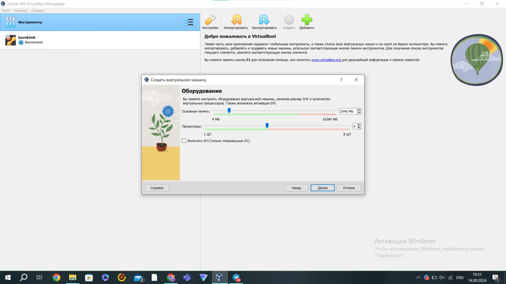
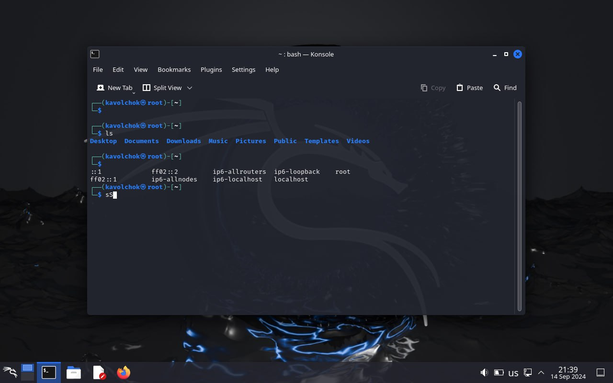

---
## Front matter
title: "Индивидуальный проект 1"
subtitle: "Информационная безопасность "
author: "Волчок Кристина Александровна НПМбд-02-21"

## Generic otions
lang: ru-RU
toc-title: "Содержание"

## Bibliography
bibliography: bib/cite.bib
csl: pandoc/csl/gost-r-7-0-5-2008-numeric.csl

## Pdf output format
toc: true # Table of contents
toc-depth: 2
lof: true # List of figures
fontsize: 12pt
linestretch: 1.5
papersize: a4
documentclass: scrreprt
## I18n polyglossia
polyglossia-lang:
  name: russian
  options:
	- spelling=modern
	- babelshorthands=true
polyglossia-otherlangs:
  name: english
## I18n babel
babel-lang: russian
babel-otherlangs: english
## Fonts
mainfont: IBM Plex Serif
romanfont: IBM Plex Serif
sansfont: IBM Plex Sans
monofont: IBM Plex Mono
mathfont: STIX Two Math
mainfontoptions: Ligatures=Common,Ligatures=TeX,Scale=0.94
romanfontoptions: Ligatures=Common,Ligatures=TeX,Scale=0.94
sansfontoptions: Ligatures=Common,Ligatures=TeX,Scale=MatchLowercase,Scale=0.94
monofontoptions: Scale=MatchLowercase,Scale=0.94,FakeStretch=0.9
mathfontoptions:
## Biblatex
biblatex: true
biblio-style: "gost-numeric"
biblatexoptions:
  - parentracker=true
  - backend=biber
  - hyperref=auto
  - language=auto
  - autolang=other*
  - citestyle=gost-numeric
## Pandoc-crossref LaTeX customization
figureTitle: "Рис."
tableTitle: "Таблица"
listingTitle: "Листинг"
lofTitle: "Список иллюстраций"
lolTitle: "Листинги"
## Misc options
indent: true
header-includes:
  - \usepackage{indentfirst}
  - \usepackage{float} # keep figures where there are in the text
  - \floatplacement{figure}{H} # keep figures where there are in the text
---

## Цели работы

Целью данного этапа является установка и настройка Kali Linux в виртуальной среде с использованием VirtualBox. Kali Linux необходим для проведения практических задач по тестированию на проникновение и обеспечению безопасности информационных систем. Установка этой системы в виртуальной машине позволит работать безопасно и изолированно от основной системы.

## Этап 1. Установка Kali Linux

### 1. Загрузка образа Kali Linux
Для начала я скачала образ Kali Linux с официального сайта [Kali Linux](https://www.kali.org/). Kali Linux — это дистрибутив на базе Debian, который включает множество инструментов для тестирования на проникновение и обеспечения безопасности.

### 2. Установка виртуальной машины
Для установки Kali Linux я решила использовать VirtualBox, так как это удобный и бесплатный инструмент для создания виртуальных машин. На этом этапе я скачала и установила VirtualBox на свой компьютер.

### 3. Настройка виртуальной машины
После установки VirtualBox я создала новую виртуальную машину:
- Выбрала тип операционной системы: Linux;
- Указала версию: Debian (64-bit);
- Выделила 2 ГБ оперативной памяти и 20 ГБ места на жёстком диске.

### 4. Установка Kali Linux
После загрузки ISO-образа Kali Linux в VirtualBox я запустила установку. Следовала стандартным шагам:
1. Выбор языка и региона.
2. Настройка сетевых параметров.
3. Настройка дисковой системы (использовала всё доступное место на виртуальном диске).

### 5. Завершение установки и первый запуск
После завершения установки я перезагрузила виртуальную машину. По умолчанию использовала следующие учётные данные для входа:
- **Логин:** root
- **Пароль:** toor

Теперь система готова к использованию и дальнейшим настройкам для проекта.

### Скриншоты этапов:

## Выводы

На этом этапе я успешно установила Kali Linux в виртуальную машину с использованием VirtualBox. Теперь у меня есть безопасная среда для выполнения последующих этапов проекта, связанных с тестированием безопасности. Виртуальная машина обеспечивает изоляцию от основной системы, что позволяет работать с инструментами Kali Linux, не подвергая риску основной компьютер.

Этап выполнен успешно, и все цели по установке системы достигнуты.

