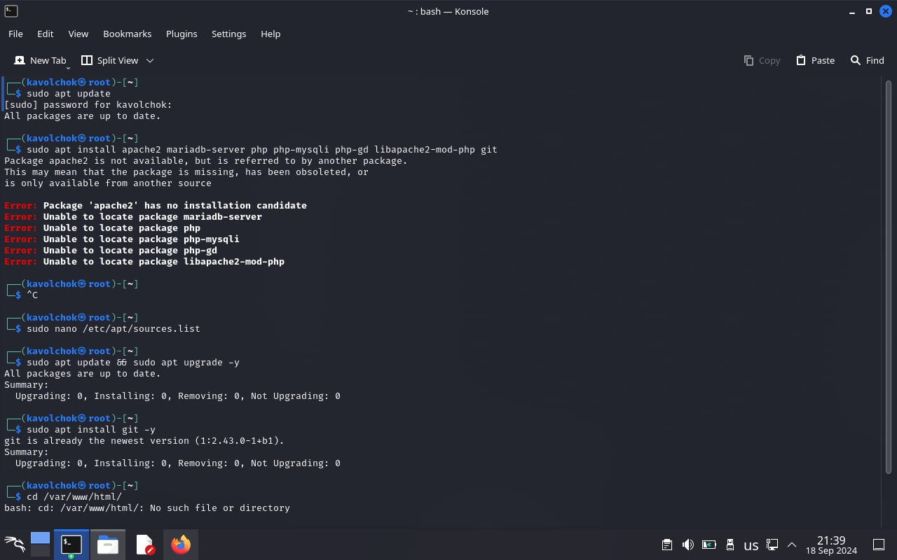
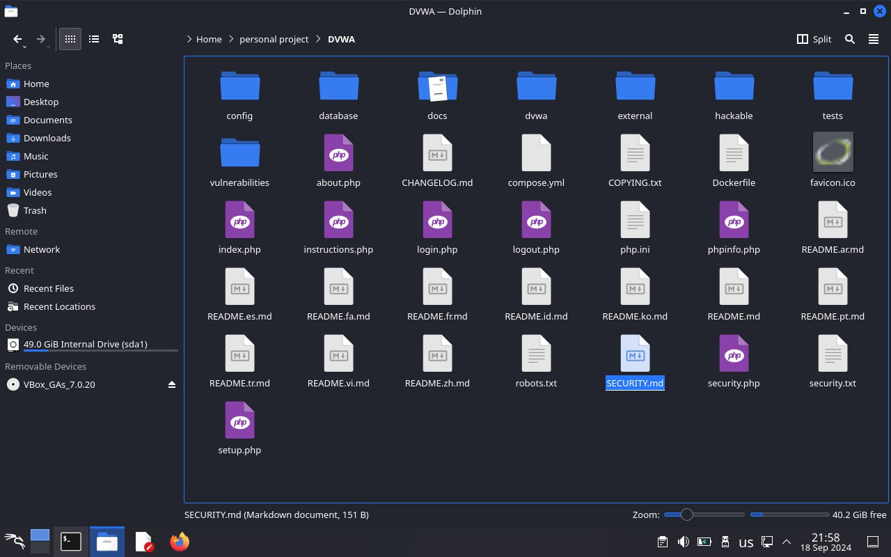

---
## Front matter
lang: ru-RU
title: Индивидуальный проект 2
subtitle: Информационная безопасность 
author: Волчок Кристина Александровна НПМбд-02-21

## Generic otions
lang: ru-RU
toc-title: "Содержание"

## Bibliography
bibliography: bib/cite.bib
csl: pandoc/csl/gost-r-7-0-5-2008-numeric.csl

## Pdf output format
toc: true # Table of contents
toc-depth: 2
fontsize: 12pt
linestretch: 1.5
papersize: a4
documentclass: scrreprt
## I18n polyglossia
polyglossia-lang:
  name: russian
  options:
	- spelling=modern
	- babelshorthands=true
polyglossia-otherlangs:
  name: english
## I18n babel
babel-lang: russian
babel-otherlangs: english
## Fonts
mainfont: IBM Plex Serif
romanfont: IBM Plex Serif
sansfont: IBM Plex Sans
monofont: IBM Plex Mono
mathfont: STIX Two Math
mainfontoptions: Ligatures=Common,Ligatures=TeX,Scale=0.94
romanfontoptions: Ligatures=Common,Ligatures=TeX,Scale=0.94
sansfontoptions: Ligatures=Common,Ligatures=TeX,Scale=MatchLowercase,Scale=0.94
monofontoptions: Scale=MatchLowercase,Scale=0.94,FakeStretch=0.9
mathfontoptions:
## Biblatex
biblatex: true
biblio-style: "gost-numeric"
biblatexoptions:
  - parentracker=true
  - backend=biber
  - hyperref=auto
  - language=auto
  - autolang=other*
  - citestyle=gost-numeric
## Pandoc-crossref LaTeX customization
figureTitle: "Рис."
tableTitle: "Таблица"
listingTitle: "Листинг"
lofTitle: "Список иллюстраций"
lolTitle: "Листинги"
## Misc options
indent: true
header-includes:
  - \usepackage{indentfirst}
  - \usepackage{float} # keep figures where there are in the text
  - \floatplacement{figure}{H} # keep figures where there are in the text
---

# Цель работы

Установить Damn Vulnerable Web Application (DVWA) в гостевую систему Kali Linux для изучения и практики в области безопасности веб-приложений.

# Задание

- Установить DVWA в гостевую систему Kali Linux.
- Использовать репозиторий: https://github.com/digininja/DVWA.
- Ознакомиться с основными уязвимостями, которые содержит DVWA.
- Понять различия между уровнями безопасности, предлагаемыми DVWA.

# Теоретическое введение

**Теоретическое введение**

**DVWA (Damn Vulnerable Web Application)** — это уязвимое веб-приложение, специально созданное для обучения и практики в области веб-безопасности. Оно содержит преднамеренные уязвимости для отработки техник их обнаружения и эксплуатации.

**Основные уязвимости DVWA:**

- **Брутфорс**: атака методом перебора паролей через форму входа.
- **Исполнение команд**: возможность выполнять команды операционной системы через веб-интерфейс.
- **CSRF (Межсайтовая подделка запроса)**: позволяет изменить пароль администратора без его ведома.
- **Внедрение файлов**: подключение удаленных или локальных файлов в приложение.
- **SQL-инъекция**: внедрение SQL-запросов через поля ввода.
- **Небезопасная загрузка файлов**: загрузка вредоносных файлов на сервер.
- **XSS (Межсайтовый скриптинг)**: внедрение скриптов в приложение или базу данных.
- **Пасхальные яйца**: скрытые уязвимости, такие как раскрытие полных путей и обход аутентификации.

**Уровни безопасности DVWA:**

- **Низкий**: полностью уязвимый уровень без какой-либо защиты.
- **Средний**: попытки защитить приложение, которые оказались неэффективными.
- **Высокий**: уязвимости есть, но их эксплуатация затруднена.
- **Невозможный**: все уязвимости устранены; используется для сравнения с уязвимыми уровнями.


# Выполнение лабораторной работы

**Процесс установки DVWA**

**Обновление системы:**

Для начала я обновляю систему с помощью следующей команды:

`(sudo apt update && sudo apt upgrade -y)`



**Установка необходимых пакетов:**

После обновления системы я устанавливаю необходимые пакеты:


**Запуск и настройка служб:**

Затем я запускаю и настраиваю службы Apache и MariaDB для их автоматического запуска при старте системы:


**Настройка базы данных:**

После того как службы запущены, я перехожу к настройке базы данных:

`(sudo mysql_secure_installation)`  
`(sudo mysql -u root -p)`

В MySQL я ввожу следующие команды для создания базы данных и пользователя:

```sql
CREATE DATABASE dvwa;
CREATE USER 'dvwauser'@'localhost' IDENTIFIED BY 'password';
GRANT ALL PRIVILEGES ON dvwa.* TO 'dvwauser'@'localhost';
FLUSH PRIVILEGES;
EXIT;


** Клонирование репозитория DVWA:**

Теперь я клонирую репозиторий DVWA в директорию веб-сервера:

`(cd /var/www/html/)`  
`(sudo git clone https://github.com/digininja/DVWA.git)`

**Настройка прав доступа:**

Я убеждаюсь, что права доступа к директории настроены корректно:

`(sudo chown -R www-data:www-data /var/www/html/DVWA/)`  
`(sudo chmod -R 755 /var/www/html/DVWA/)`

После этого я перехожу в папку конфигурации и настраиваю файл:

`(cd /var/www/html/DVWA/config/)`  
`(sudo cp config.inc.php.dist config.inc.php)`  
`(sudo nano config.inc.php)`

**Завершение установки через браузер:**

Я открываю браузер и перехожу по адресу:

`http://localhost/DVWA/setup.php`

Нажимаю кнопку "Create / Reset Database".

**Вход в DVWA:**

Перехожу на страницу входа:

`http://localhost/DVWA/login.php`

Ввожу следующие данные для входа:

- Имя пользователя: `admin`
- Пароль: `password`



# Выводы

В результате выполнения задания была успешно установлена DVWA в гостевую систему Kali Linux. Это позволяет получить практический опыт в области веб-безопасности, изучая и эксплуатируя различные уязвимости. Работа с DVWA способствует повышению квалификации и пониманию методов защиты веб-приложений.

