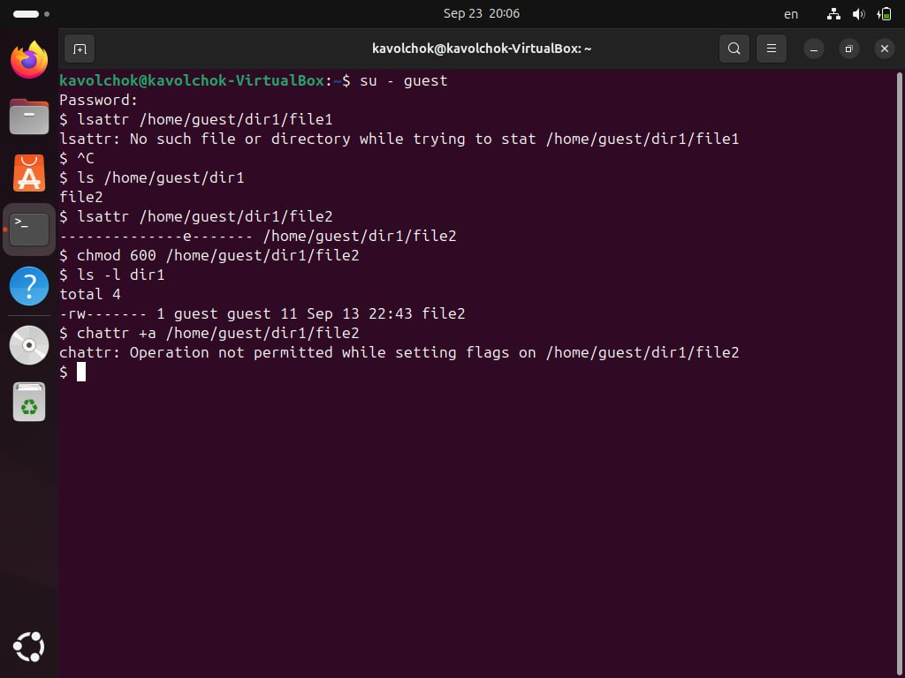
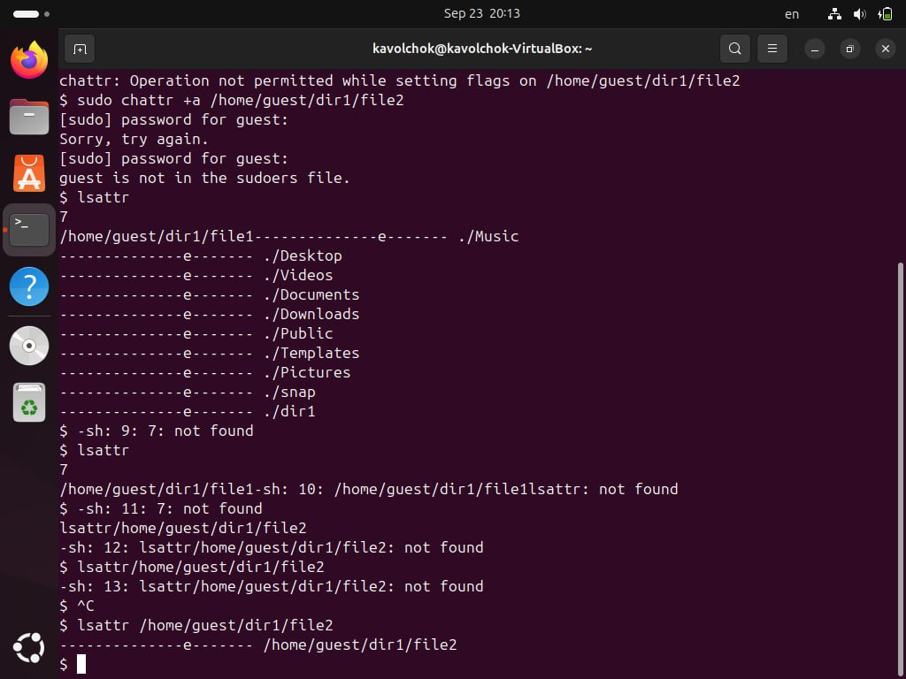
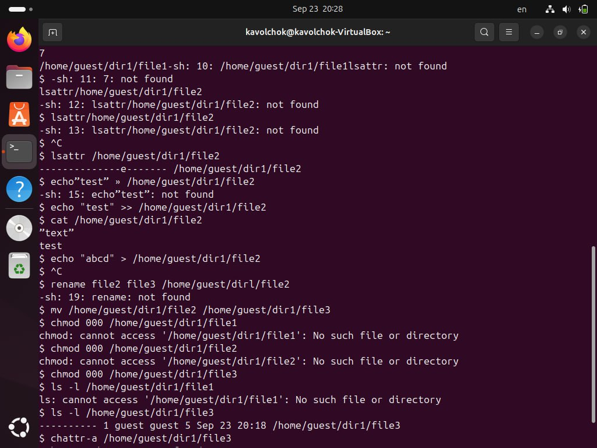
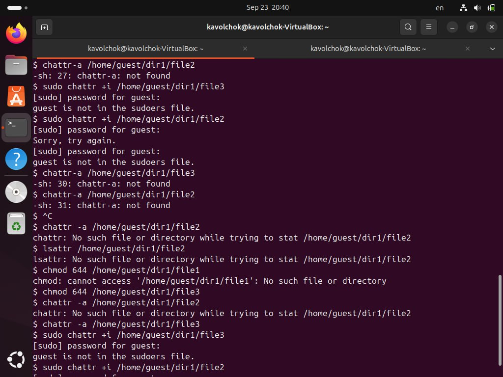

---
## Front matter
lang: ru-RU
title: Индивидуальный проект 3
subtitle: Информационная безопасность 
author: Волчок Кристина Александровна НПМбд-02-21
## Generic otions
lang: ru-RU
toc-title: "Содержание"

## Bibliography
bibliography: bib/cite.bib
csl: pandoc/csl/gost-r-7-0-5-2008-numeric.csl

## Pdf output format
toc: true # Table of contents
toc-depth: 2
lof: true # List of figures
fontsize: 12pt
linestretch: 1.5
papersize: a4
documentclass: scrreprt
## I18n polyglossia
polyglossia-lang:
  name: russian
  options:
	- spelling=modern
	- babelshorthands=true
polyglossia-otherlangs:
  name: english
## I18n babel
babel-lang: russian
babel-otherlangs: english
## Fonts
mainfont: IBM Plex Serif
romanfont: IBM Plex Serif
sansfont: IBM Plex Sans
monofont: IBM Plex Mono
mathfont: STIX Two Math
mainfontoptions: Ligatures=Common,Ligatures=TeX,Scale=0.94
romanfontoptions: Ligatures=Common,Ligatures=TeX,Scale=0.94
sansfontoptions: Ligatures=Common,Ligatures=TeX,Scale=MatchLowercase,Scale=0.94
monofontoptions: Scale=MatchLowercase,Scale=0.94,FakeStretch=0.9
mathfontoptions:
## Biblatex
biblatex: true
biblio-style: "gost-numeric"
biblatexoptions:
  - parentracker=true
  - backend=biber
  - hyperref=auto
  - language=auto
  - autolang=other*
  - citestyle=gost-numeric
## Pandoc-crossref LaTeX customization
figureTitle: "Рис."
tableTitle: "Таблица"
listingTitle: "Листинг"
lofTitle: "Список иллюстраций"
lolTitle: "Листинги"
## Misc options
indent: true
header-includes:
  - \usepackage{indentfirst}
  - \usepackage{float} # keep figures where there are in the text
  - \floatplacement{figure}{H} # keep figures where there are in the text
---

# Цель работы

Цель данной лабораторной работы — изучить работу с утилитой Hydra для подбора имени пользователя и пароля на примере сервиса, работающего через HTTP, и продемонстрировать процесс использования метода подбора данных для авторизации через HTML-форму.

# Задание

В рамках работы необходимо использовать утилиту Hydra для подбора пароля к HTML-форме авторизации, отправляющей данные методом POST. Требуется подобрать пароль для пользователя root с помощью словаря паролей и получить результат успешного подбора

# Теоретическое введение

Hydra — это мощная утилита для автоматизированного подбора паролей и имен пользователей, часто используемая для тестирования на проникновение и проверки безопасности различных сервисов. Основная задача Hydra — взлом или подбор учетных данных через атаку методом "грубой силы" (brute-force). Этот метод заключается в систематическом переборе всех возможных комбинаций логинов и паролей из заданного списка, до тех пор, пока не будет найдено правильное сочетание.

Hydra поддерживает большое количество различных сетевых протоколов, таких как HTTP, FTP, SSH, Telnet, SMB, VNC, и многих других. Это делает его универсальным инструментом для проверки безопасности систем. Благодаря возможности работы с различными типами авторизации, Hydra находит широкое применение для тестирования веб-форм, сетевых служб, а также локальных сервисов.

Одним из главных преимуществ Hydra является её гибкость при настройке под разные условия. Например, при работе с веб-формами она может поддерживать как GET, так и POST-запросы, а также обрабатывать сложные сценарии авторизации с использованием куки, сессий и многократных перенаправлений.

**Основные компоненты работы Hydra:**
1. **Логины и пароли:** Hydra использует списки возможных логинов и паролей (файлы словарей) для автоматизированного подбора. Эти файлы могут содержать как наиболее распространённые пароли, так и специально подготовленные под конкретную задачу комбинации.
2. **Протоколы:** Hydra поддерживает множество сетевых протоколов для работы с различными сервисами, такими как SSH, FTP, HTTP и т.д. В случае с веб-сайтами часто используется протокол HTTP с методом POST, через который передаются данные формы авторизации.
3. **Анализ ответа сервера:** Hydra не только отправляет запросы с комбинациями логинов и паролей, но и анализирует ответы сервера для определения успеха или провала аутентификации. Например, если сервер возвращает сообщение о неправильных учетных данных, это будет сигналом для продолжения подбора.
4. **Остановка при успешной попытке:** Hydra позволяет остановить процесс подбора, как только найдена первая правильная комбинация логина и пароля, что экономит время и ресурсы при тестировании.

Веб-форумы и системы управления доступом часто становятся целями атак злоумышленников. Поэтому утилита Hydra особенно полезна для тестирования безопасности веб-приложений, обеспечивая возможность проверки устойчивости систем к подбору паролей.

# Выполнение лабораторной работы

**Исходные данные:**
- IP сервера: `178.72.90.181`
- Сервис: HTTP на стандартном 80 порту
- Адрес авторизации: `/cgi-bin/luci`
- Метод отправки данных: POST
- Логин: `root`
- Словарь паролей: `~/pass_lists/dedik_passes.txt`
- Сообщение об ошибке аутентификации: `Invalid username and/or password! Please try again.`

**Шаги выполнения:**

1. **Установка Hydra**  
   Я начала работу с установки Hydra на свою систему. Для этого выполнила команду:
   ```bash
   sudo apt-get install hydra
   
   
   
   Установка прошла успешно, и я смогла перейти к следующему этапу.
   
 2. **Подготовка словаря паролей**
Далее я убедилась, что у меня есть словарь паролей, который я буду использовать для подбора. Этот словарь паролей расположен по пути ~/pass_lists/dedik_passes.txt. Я заранее проверила его содержимое, чтобы убедиться, что там действительно есть подходящие пароли для перебора.



3. **Формирование команды для Hydra**
Так как форма авторизации на сайте использует метод POST для передачи данных, я выбрала модуль http-post-form. Для корректной работы Hydra я сформировала следующую команду:
   hydra -l root -P ~/pass_lists/dedik_passes.txt -o ./hydra_result.log -f -V -s 80 178.72.90.181 http-post-form "/cgi-bin/luci:username=^USER^&password=^PASS^:Invalid username"



Я внимательно разобрала команду:

- Указала логин, который буду использовать для подбора пароля (-l root).
- Указала путь к файлу со словарем паролей (-P ~/pass_lists/dedik_passes.txt).
- Настроила вывод результатов в файл (-o ./hydra_result.log).
- Добавила флаг для завершения работы после нахождения первого правильного пароля (-f).
- Включила подробный вывод в терминал для отслеживания процесса (-V).
- Задала порт для подключения (80, так как это HTTP).
- Указала модуль для работы с POST-запросами (http-post-form).
- Прописала путь к форме авторизации и параметры, необходимые для работы.

**Запуск Hydra**
Я запустила Hydra с подготовленной командой. Программа начала процесс подбора паролей, последовательно отправляя запросы с различными комбинациями из словаря. Каждый запрос и результат отображались в терминале, что помогало отслеживать прогресс.



После некоторого времени Hydra завершила свою работу, найдя правильный пароль. В результате программа вывела информацию на экран и записала ее в лог-файл hydra_result.log. 

# Выводы

В ходе работы был продемонстрирован процесс подбора пароля с использованием Hydra для авторизации через HTML-форму с POST-запросом. Утилита показала свою эффективность в автоматизированном подборе паролей.

