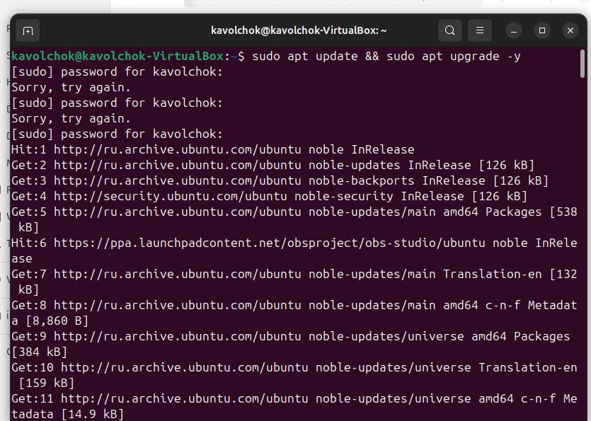
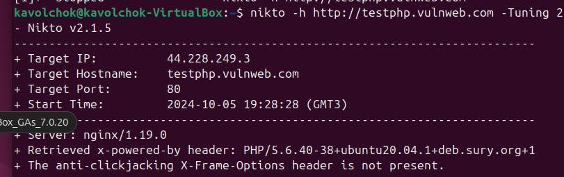
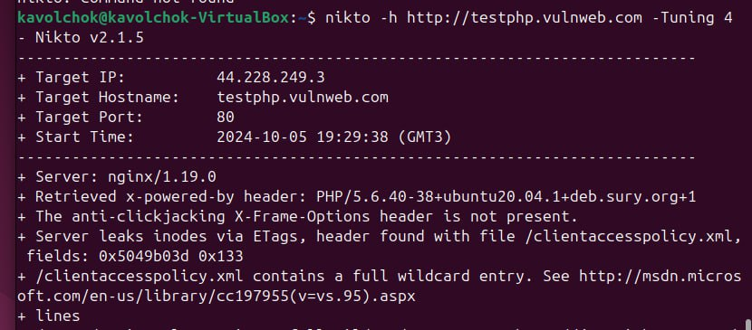

---
## Front matter
lang: ru-RU
title: Индивидуальный проект 4
subtitle: Информационная безопасность 
author: Волчок Кристина Александровна НПМбд-02-21
## Generic otions
lang: ru-RU
toc-title: "Содержание"

## Bibliography
bibliography: bib/cite.bib
csl: pandoc/csl/gost-r-7-0-5-2008-numeric.csl

## Pdf output format
toc: true # Table of contents
toc-depth: 2
lof: true # List of figures
fontsize: 12pt
linestretch: 1.5
papersize: a4
documentclass: scrreprt
## I18n polyglossia
polyglossia-lang:
  name: russian
  options:
	- spelling=modern
	- babelshorthands=true
polyglossia-otherlangs:
  name: english
## I18n babel
babel-lang: russian
babel-otherlangs: english
## Fonts
mainfont: IBM Plex Serif
romanfont: IBM Plex Serif
sansfont: IBM Plex Sans
monofont: IBM Plex Mono
mathfont: STIX Two Math
mainfontoptions: Ligatures=Common,Ligatures=TeX,Scale=0.94
romanfontoptions: Ligatures=Common,Ligatures=TeX,Scale=0.94
sansfontoptions: Ligatures=Common,Ligatures=TeX,Scale=MatchLowercase,Scale=0.94
monofontoptions: Scale=MatchLowercase,Scale=0.94,FakeStretch=0.9
mathfontoptions:
## Biblatex
biblatex: true
biblio-style: "gost-numeric"
biblatexoptions:
  - parentracker=true
  - backend=biber
  - hyperref=auto
  - language=auto
  - autolang=other*
  - citestyle=gost-numeric
## Pandoc-crossref LaTeX customization
figureTitle: "Рис."
tableTitle: "Таблица"
listingTitle: "Листинг"
lofTitle: "Список иллюстраций"
lolTitle: "Листинги"
## Misc options
indent: true
header-includes:
  - \usepackage{indentfirst}
  - \usepackage{float} # keep figures where there are in the text
  - \floatplacement{figure}{H} # keep figures where there are in the text
---

# Цель работы

Цель данной работы — освоить использование базового сканера безопасности веб-сервера **Nikto** для выявления и анализа уязвимостей веб-приложений. `Nikto` позволяет обнаруживать потенциальные риски безопасности, которые могут возникнуть из-за неправильной конфигурации сервера, использования файлов по умолчанию, небезопасных файлов и устаревших серверных приложений. В ходе работы будет проведено сканирование веб-сервера с использованием различных опций и параметров `Nikto`, а также изучены результаты для последующего анализа и принятия мер по усилению безопасности веб-приложений.

# Задание

1. Установить сканер безопасности веб-сервера **Nikto** на операционной системе Ubuntu.
2. Провести базовое сканирование уязвимостей на учебном веб-сайте (например, `http://testphp.vulnweb.com`) с помощью команды:
   nikto -h http://testphp.vulnweb.com
   
# Теоретическое введение

С ростом использования веб-приложений в различных сферах деятельности безопасность веб-серверов и веб-приложений становится одним из ключевых аспектов информационной безопасности. Уязвимости в веб-серверах могут возникать из-за неправильной конфигурации, использования устаревших версий программного обеспечения, а также наличия небезопасных файлов и скриптов. Невнимательность к этим аспектам может привести к серьезным последствиям, включая утечку данных, взлом систем и компрометацию веб-приложений.

**Nikto** — это популярный инструмент для сканирования безопасности веб-серверов. Он позволяет быстро и эффективно находить уязвимости и слабые места на веб-серверах и веб-приложениях. Nikto выполняет проверку на наличие более чем 6700 потенциально опасных файлов и программ, проверяет конфигурацию веб-сервера на наличие уязвимостей, а также определяет устаревшие версии веб-серверов и их компонентов.

Nikto осуществляет следующие виды проверок:
- Сканирование директорий и файлов, которые могут представлять угрозу (например, резервные копии или файлы, установленные по умолчанию).
- Выявление потенциально уязвимых CGI-скриптов.
- Проверка конфигурации веб-сервера на предмет наличия ошибок и неправильно настроенных параметров.
- Определение устаревших серверных программ, которые могут содержать известные уязвимости.
- Поиск информационных утечек, которые могут раскрывать чувствительную информацию злоумышленникам.

В процессе сканирования с помощью Nikto используется база данных уязвимостей, которая регулярно обновляется, обеспечивая актуальность проверки. Несмотря на свою эффективность, Nikto является инструментом пассивного сканирования, то есть он не производит активного тестирования безопасности, такого как внедрение вредоносного кода или эксплуатация обнаруженных уязвимостей. Однако даже такой подход может быть крайне полезен для выявления наиболее распространенных проблем безопасности и принятия своевременных мер по их устранению.

Таким образом, использование Nikto позволяет администратору веб-сервера или специалисту по безопасности получить общее представление о текущем состоянии защищенности веб-сервера и выявить области, требующие дальнейшей проработки и исправления.

# Выполнение лабораторной работы

Для начала я обновила систему, чтобы убедиться, что все пакеты актуальны. Для этого я выполнила команду:

После этого система запросила мой пароль для sudo, и, после его успешного ввода, началось обновление списка пакетов. Затем я убедилась, что система полностью обновлена.

Затем я приступила к установке инструмента Nikto. Для этого я выполнила команду:

На моем компьютере Nikto уже был установлен (версия v2.1.5), поэтому система сообщила, что дополнительных действий по установке не требуется.

**Базовое сканирование с помощью Nikto**

После установки я решила провести базовое сканирование тестового сайта, используя следующую команду:

В результате сканирования я получила информацию о целевом IP (44.228.249.3), порте (80), а также о версии веб-сервера (nginx/1.19.0). Nikto обнаружил следующие уязвимости:

Используемая версия PHP (5.6.40) устарела и может содержать известные уязвимости.
Отсутствует заголовок X-Frame-Options, что делает сайт уязвимым к атакам типа clickjacking.
Обнаружена утечка данных через ETag в файле clientaccesspolicy.xml.
Этот результат показал мне, что сервер имеет несколько потенциальных проблем безопасности, требующих внимания.

**Целевое сканирование на устаревшие серверные программы**

Далее я решила просканировать сервер на наличие устаревших программных компонентов. Для этого я использовала флаг -Tuning 2:

Результаты сканирования подтвердили наличие устаревшей версии PHP (5.6.40-38). Кроме того, было отмечено отсутствие заголовка X-Frame-Options, что снова указало на возможную уязвимость для clickjacking.

**Проверка информационных утечек**
Следующим этапом я решила провести сканирование на утечки информации, используя параметр -Tuning 4:

На этот раз Nikto обнаружил:

Отсутствие защитного заголовка X-Frame-Options.
Утечку данных через ETag в файле clientaccesspolicy.xml.
Файл clientaccesspolicy.xml с полным wildcard-разрешением, что может позволить злоумышленникам получить доступ к различным ресурсам сервера.
Этот этап помог мне выявить потенциальные утечки информации, которые могли бы использоваться злоумышленниками.

**Комбинированное сканирование на конфигурационные уязвимости и резервные файлы**

Для более комплексного анализа я выполнила комбинированное сканирование, чтобы проверить как конфигурационные уязвимости, так и наличие резервных файлов:

В данном случае я использовала флаг -Tuning 58, который позволяет провести сразу два вида сканирования: на конфигурационные уязвимости (5) и на резервные файлы (8). В результатах я увидела:

Отсутствие заголовка X-Frame-Options.
Утечка данных через ETag в файле clientaccesspolicy.xml.
Наличие файла clientaccesspolicy.xml с полным wildcard-разрешением.
Этот комбинированный анализ позволил мне выявить как ошибки в конфигурации сервера, так и потенциально опасные файлы, доступные в системе.

# Выводы

- Инструмент Nikto был успешно установлен и использован для сканирования тестового веб-сайта на наличие различных типов уязвимостей.
- Проведены как базовое, так и специализированные сканирования для анализа устаревших серверных программ, информационных утечек и конфигурационных ошибок.
- Результаты сканирования показали наличие ряда уязвимостей на целевом веб-сервере, включая устаревшую версию PHP, отсутствие защитных заголовков, утечки данных и файлы с недостаточной политикой безопасности.
- На основе этих данных были получены важные сведения для принятия дальнейших мер по усилению безопасности веб-приложения.
Этот процесс позволяет продемонстрировать, как с помощью Nikto можно выявить уязвимости и оценить уровень безопасности веб-сервера.
