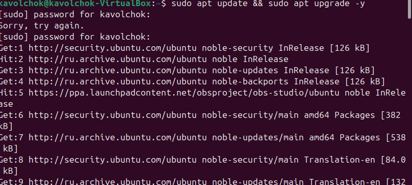
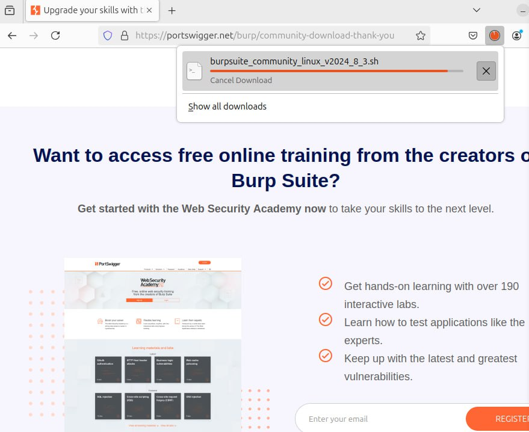
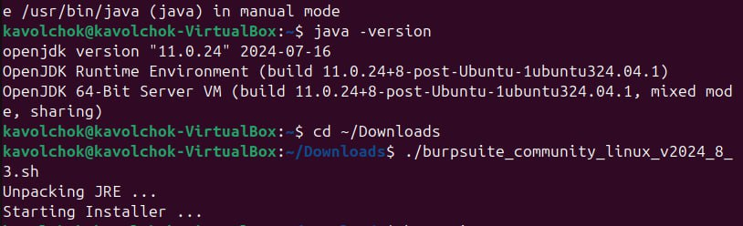
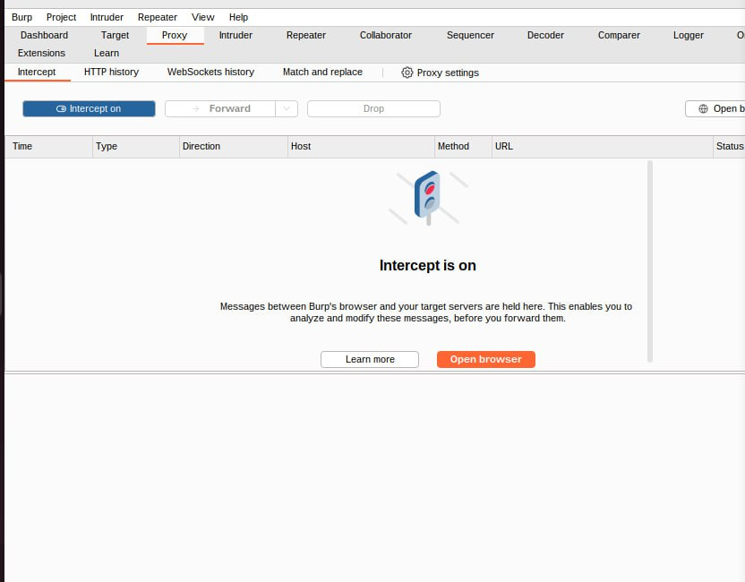
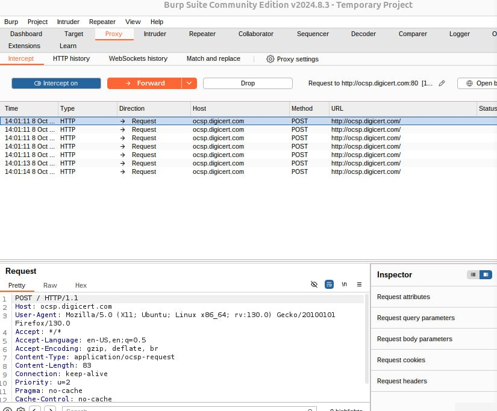

---
## Front matter
lang: ru-RU
title: Индивидуальный проект 5
subtitle: Информационная безопасность 
author: Волчок Кристина Александровна НПМбд-02-21
## Generic otions
lang: ru-RU
toc-title: "Содержание"

## Bibliography
bibliography: bib/cite.bib
csl: pandoc/csl/gost-r-7-0-5-2008-numeric.csl

## Pdf output format
toc: true # Table of contents
toc-depth: 2
lof: true # List of figures
fontsize: 12pt
linestretch: 1.5
papersize: a4
documentclass: scrreprt
## I18n polyglossia
polyglossia-lang:
  name: russian
  options:
	- spelling=modern
	- babelshorthands=true
polyglossia-otherlangs:
  name: english
## I18n babel
babel-lang: russian
babel-otherlangs: english
## Fonts
mainfont: IBM Plex Serif
romanfont: IBM Plex Serif
sansfont: IBM Plex Sans
monofont: IBM Plex Mono
mathfont: STIX Two Math
mainfontoptions: Ligatures=Common,Ligatures=TeX,Scale=0.94
romanfontoptions: Ligatures=Common,Ligatures=TeX,Scale=0.94
sansfontoptions: Ligatures=Common,Ligatures=TeX,Scale=MatchLowercase,Scale=0.94
monofontoptions: Scale=MatchLowercase,Scale=0.94,FakeStretch=0.9
mathfontoptions:
## Biblatex
biblatex: true
biblio-style: "gost-numeric"
biblatexoptions:
  - parentracker=true
  - backend=biber
  - hyperref=auto
  - language=auto
  - autolang=other*
  - citestyle=gost-numeric
## Pandoc-crossref LaTeX customization
figureTitle: "Рис."
tableTitle: "Таблица"
listingTitle: "Листинг"
lofTitle: "Список иллюстраций"
lotTitle: "Список таблиц"
lolTitle: "Листинги"
## Misc options
indent: true
header-includes:
  - \usepackage{indentfirst}
  - \usepackage{float} # keep figures where there are in the text
  - \floatplacement{figure}{H} # keep figures where there are in the text
---

# Цель работы

Целью данной работы является изучение и освоение инструментов безопасности веб-приложений с помощью Burp Suite, включая настройку перехвата трафика и анализ запросов, поступающих от веб-браузера. Особое внимание уделяется настройке HTTPS перехвата и настройке прокси-сервера для тестирования безопасности.

# Задание

1. Установить Burp Suite на операционной системе Ubuntu.
2. Настроить прокси-сервер Burp Suite для перехвата трафика веб-приложений.
3. Настроить браузер для использования прокси-сервера Burp Suite.
4. Установить сертификаты Burp Suite для перехвата HTTPS трафика.
5. Перехватить и проанализировать трафик веб-приложений, используя инструменты Burp Suite.

# Теоретическое введение

Веб-приложения стали неотъемлемой частью современных информационных систем, и их безопасность играет ключевую роль в обеспечении защиты данных и предотвращении кибератак. В процессе разработки веб-приложений возникают различные уязвимости, которые могут быть использованы злоумышленниками для несанкционированного доступа к данным, проведения атак или нарушения работы системы. Чтобы выявить и устранить эти уязвимости, необходимы специализированные инструменты для тестирования безопасности.

**Burp Suite** — это один из наиболее мощных и популярных инструментов для анализа безопасности веб-приложений. Он предоставляет возможность перехватывать, изменять и анализировать сетевые запросы и ответы, а также проводить автоматическое сканирование на наличие уязвимостей. Среди его основных компонентов — прокси-сервер для перехвата трафика, инструмент для автоматического анализа уязвимостей, тестировщик для проведения атак на веб-приложения (Intruder) и другие полезные модули.

Burp Suite также позволяет эффективно работать с зашифрованным трафиком (HTTPS), что делает его незаменимым инструментом для тестирования большинства современных веб-приложений, использующих протоколы шифрования. С помощью Burp Suite специалисты по безопасности могут выявлять и исправлять такие уязвимости, как SQL-инъекции, межсайтовые скрипты (XSS), недостатки аутентификации и другие критические проблемы.

# Выполнение лабораторной работы

Я обновила систему и установила все необходимые зависимости. Для этого в терминале выполнила команду для обновления пакетов, для этого использовала команнду "sudo apt update && sudo apt upgrade -y".

Затем установила Java, так как Burp Suite требует её для работы. Для установки выполнила команду:"sudo apt install default-jre -y"

После этого я перешла на официальный сайт Burp Suite и скачала бесплатную версию Community Edition.

Для установки Burp Suite я перешла в директорию загрузок:cd ~/Downloads.

Затем сделала скачанный файл исполняемым:
/chmod +x burpsuite_community_linux_v<version>.sh

И запустила установочный файл:
./burpsuite_community_linux_v<version>.sh

После этого я следовала инструкциям на экране и завершила установку.

**Запуск Burp Suite**

После установки я запустила Burp Suite через терминал:
burpsuite
При первом запуске выбрала версию Community Edition и приняла условия лицензии. Затем нажала кнопку "Next" для настройки проекта, использовав стандартные настройки.

**Настройка прокси-сервера Burp Suite**

Я открыла Burp Suite и настроила прокси-сервер. По умолчанию Burp Suite работает на порту 8080, поэтому я проверила настройки, открыв вкладку Proxy -> Options. В разделе Proxy Listeners убедилась, что сервер запущен на 127.0.0.1:8080.

Далее я настроила браузер Firefox для работы через прокси Burp Suite. В настройках браузера я перешла в раздел Settings -> Network Settings -> Manual proxy configuration и указала следующие параметры:
HTTP Proxy: 127.0.0.1
Port: 8080

Также отметила опцию Use this proxy server for all protocols, чтобы все типы трафика проходили через прокси-сервер Burp.

**Установка и имплементация сертификатов Burp Suite**

Для перехвата зашифрованного HTTPS-трафика я установила сертификат Burp Suite в браузер. Сначала я перешла в браузере по адресу:
http://burp

Скачала файл сертификата CA Certificate. Затем установила сертификат в браузере Firefox. Для этого я перешла в Settings -> Privacy & Security -> View Certificates -> Import, выбрала скачанный файл сертификата и установила его как доверенный для веб-приложений.

**Перехват и анализ трафика**

В Burp Suite я включила перехват трафика, перейдя во вкладку Proxy -> Intercept и активировав режим Intercept is on.

Затем открыла любой сайт в браузере, и Burp Suite начал перехватывать HTTP/HTTPS запросы. Эти запросы отображались в разделе Intercept.

Я начала анализировать перехваченные запросы, просматривала их, вносила изменения перед отправкой на сервер, а также анализировала ответы. Помимо этого, я использовала другие инструменты Burp Suite для тестирования безопасности веб-приложений.

В результате я успешно установила, настроила и использовала Burp Suite для перехвата и анализа трафика в веб-приложениях.

# Выводы

В ходе выполнения работы были изучены и применены на практике основные возможности Burp Suite для тестирования безопасности веб-приложений. Я успешно установила и настроила Burp Suite на операционной системе Ubuntu, выполнила настройку прокси-сервера и браузера для перехвата трафика, а также внедрила сертификаты для работы с HTTPS-трафиком.

В результате работы мне удалось перехватить и проанализировать HTTP и HTTPS запросы, изучить их структуру и понять, как можно вносить изменения в запросы до их отправки на сервер. Эти навыки позволили глубже погрузиться в процесс выявления уязвимостей веб-приложений, что является важным этапом обеспечения их безопасности.

Burp Suite продемонстрировал свою эффективность как инструмент для анализа и тестирования веб-приложений, предоставив широкий функционал для работы с различными типами трафика и инструментами тестирования. Это делает его важным инструментом для специалистов по информационной безопасности.

